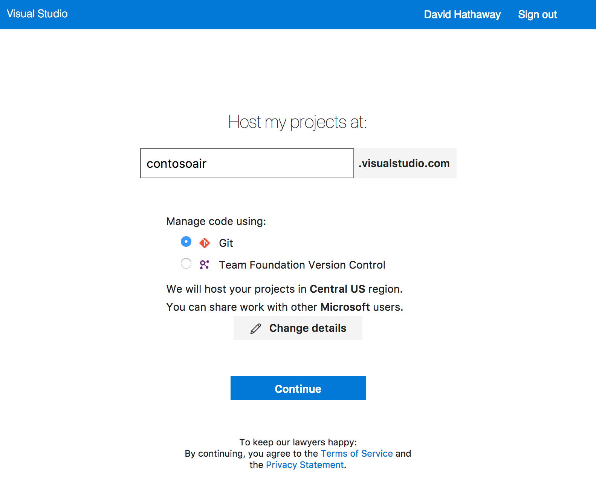
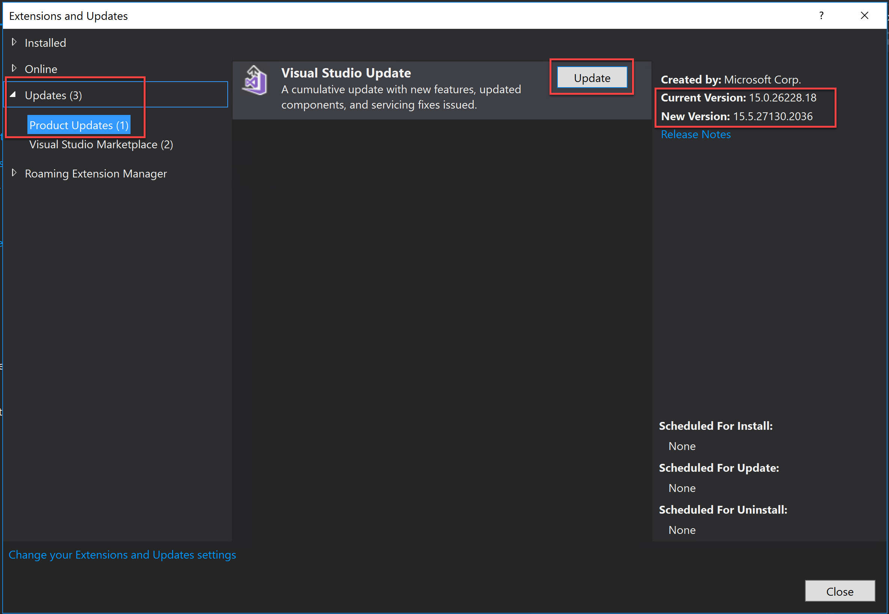
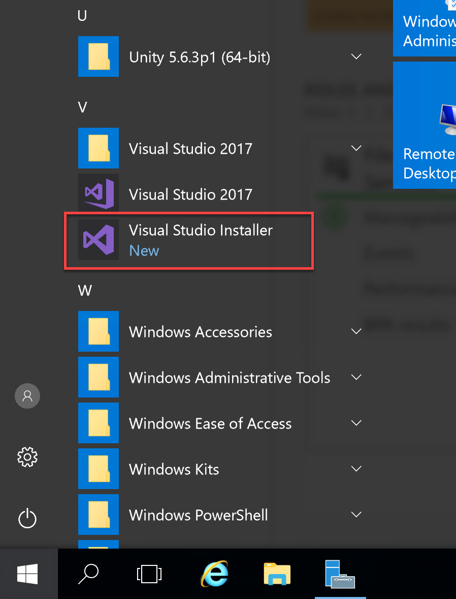
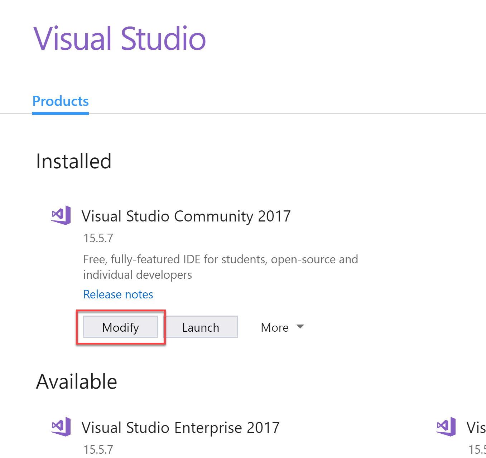
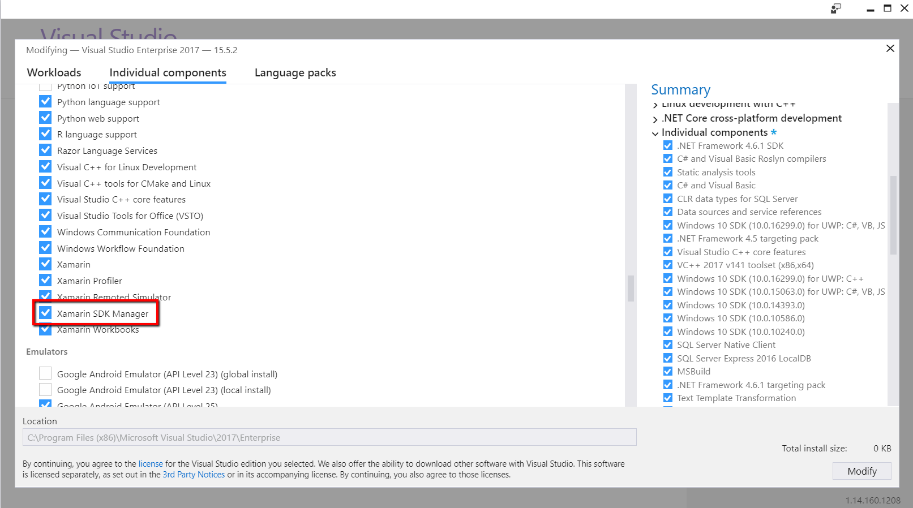
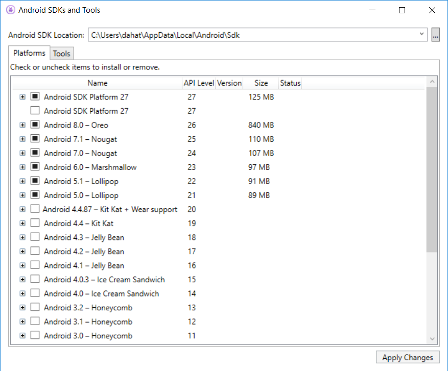
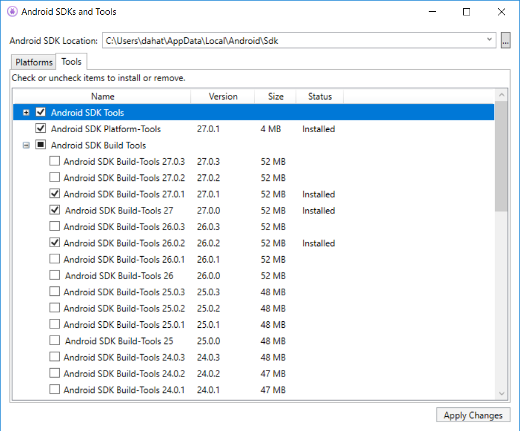
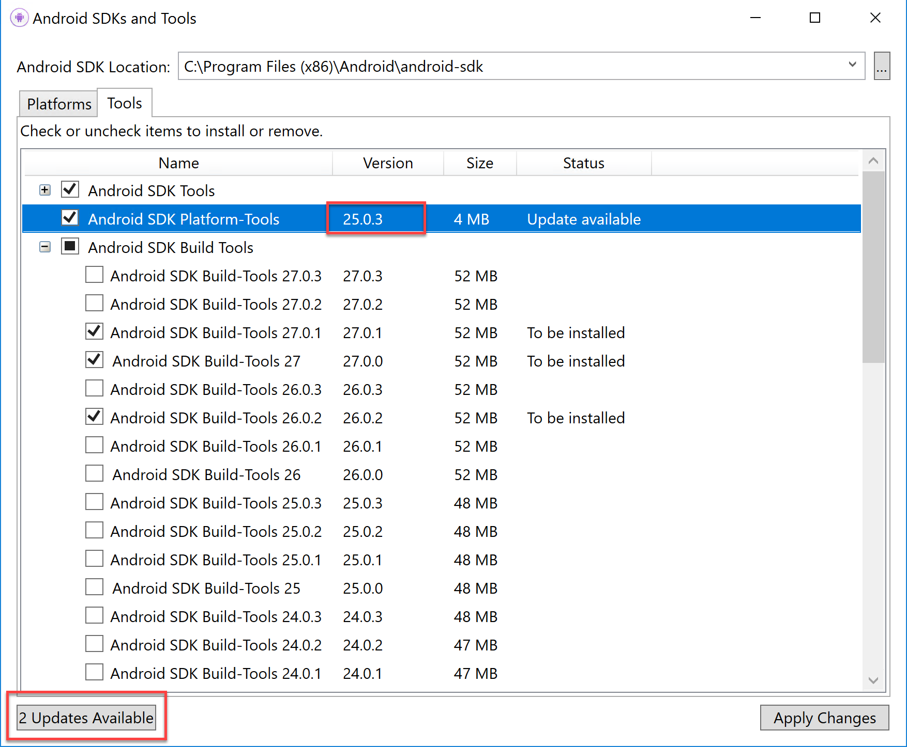

# Mobile app innovation setup

1.  Using the same Microsft.com account:

    -   Azure Subscription

    -   Visual Studio Team Services Subscription

    -   Account in Mobile Center

2.  Virtual Machine

    -   Please note, do **NOT** use a VM for this lab. You will not be able to run the simulated mobile app from a virtual machine.

3.  Local machine configured with (**complete the day before the lab!**):

    -   Windows

        i.  Workstation with VT-X Support w/Hyper-V Disabled (under Programs and Features in Windows Settings)

        ii. Intel HAXM Support installed

        Instructions: <https://developer.xamarin.com/guides/android/getting_started/installation/android-emulator/hardware-acceleration/>

        iii. Windows 10 (Fall Creators Update recommended)

        iv. Visual Studio 2017 (15.5.5 Required)

    -   Mac

        v.  Visual Studio for Mac (latest stable release)

        vi. Xcode 9.2 (or current latest stable release)

4.  Android SDKs (21, 22, 23, 24, 25, 26, 27)

5.  NET Framework 4.7.1 runtime (or higher)

    -   <https://www.microsoft.com/net/download/windows>

## Before the hands-on lab

**Duration**: 60 minutes

Completing this lab will require accounts for Azure, Visual Studio Team Services, and Visual Studio App Center, as well as an up-to-date installation of Visual Studio on Windows 10. In this exercise, we will walk through the steps needed for each of these tasks and set up your environment to complete this lab.

### Task 1: Create an account, and sign into the Azure portal

Throughout this lab, you will utilize an Azure subscription, and a Microsoft account. If you do not already have an Azure subscription, please follow the instructions at <https://azure.microsoft.com/en-us/free/> to set up your account. If you already have an account in <https://portal.azure.com>, then you can continue to the next task.

### Task 2: Sign into Visual Studio Team Services, and create a new account

1.  Browse to <https://visualstudio.com>, and sign in with the Microsoft account used to access the Azure Portal in the previous step.

2.  If you have not already created an account in Visual Studio Team services, select the button to create a new app.

    
    
3.  Choose a name for your project (it will need to be unique), and choose "Git" as the source control mechanism.

4.  Select **Continue**.

    

After a few minutes, your new account will be created, and a new project (MyFirstProject) will be automatically created. We won't use this project for the app, but you can just ignore it and leave it in your account.

### Task 3: Sign into Visual Studio App Center

In addition to the Azure portal, you will utilize Visual Studio App Center for building and monitoring your mobile app. Please browse to <https://appcenter.ms>/apps and sign in with the same Microsoft account you used in the previous task. This will ensure that you can utilize things like data export between App Center and Application Insights in Azure.

### Task 4: Update VS 2017 to 15.5.5

1.  Launch Visual Studio 2017

2.  Select **Tools \> Extensions and Updates**

3.  Expand **Updates** in the left-hand menu, then select **Product Updates**.

4.  If you see an option for Visual Studio Update, select **Update**.

5.  Follow the prompts to start the update to VS 2017 15.5.5 or greater.
    **WARNING**: This update process can take up to an hour to complete.

6.  After the update is complete, you'll need to install the **Xamarin SDK Manager** extension.

    -   Launch Visual Studio Installer. You can find the installer in the Windows Start menu.
        
        

    -   Select the **Modify** button.
        
        

    -   Select the **Individual components** tab.

    -   Scroll down to the **Development Activities** section. Make sure the **Xamarin SDK Manager** box is checked, and then select the **Modify** button in the bottom right corner of the dialog to proceed.

> 

e.  Once all updates are completed installing, restart your VM.

### Task 5: Update Android SDKs

To complete these exercises, you will need to make sure you have all the correct Android SDKs. This requires some additional steps after completing the upgrade.

1.  Launch Visual Studio 2017.

2.  Select **Tools \> Android \> Android SDK Manager**.

3.  Select each of the Android SDK platforms from 5.0 (Lollipop) -- 8.0 (Oreo).

-   API Levels 21, 22, 23, 24, 25, 26

4.  Select **Apply Changes** to download and install the selected API levels.

    

5.  Choose the **Tools** tab.

6.  Make sure that a version 27.0.x of Android SDK Platform-Tools and Android SDK Build-Tools are installed.

    

7.  If the available Android SDK Platform-Tools version is less than 27.0.x, select the **Updates Available** button on the bottom-left corner of the dialog.

    

8.  After installing the updates, you may need to re-select the **Android SDK Build Tools** and **Platform-Tools.**

9.  Select **Apply Changes**.

You should follow all steps provided *before* attending the Hands-on lab.
