<div class="MCWHeader1">
Mobile app innovation
</div>

<div class="MCWHeader2">
Hands-on lab step-by-step
</div>

<div class="MCWHeader3">
February 2018
</div>

Information in this document, including URL and other Internet Web site references, is subject to change without notice. Unless otherwise noted, the example companies, organizations, products, domain names, e-mail addresses, logos, people, places, and events depicted herein are fictitious, and no association with any real company, organization, product, domain name, e-mail address, logo, person, place or event is intended or should be inferred. Complying with all applicable copyright laws is the responsibility of the user. Without limiting the rights under copyright, no part of this document may be reproduced, stored in or introduced into a retrieval system, or transmitted in any form or by any means (electronic, mechanical, photocopying, recording, or otherwise), or for any purpose, without the express written permission of Microsoft Corporation.

Microsoft may have patents, patent applications, trademarks, copyrights, or other intellectual property rights covering subject matter in this document. Except as expressly provided in any written license agreement from Microsoft, the furnishing of this document does not give you any license to these patents, trademarks, copyrights, or other intellectual property.

The names of manufacturers, products, or URLs are provided for informational purposes only and Microsoft makes no representations and warranties, either expressed, implied, or statutory, regarding these manufacturers or the use of the products with any Microsoft technologies. The inclusion of a manufacturer or product does not imply endorsement of Microsoft of the manufacturer or product. Links may be provided to third party sites. Such sites are not under the control of Microsoft and Microsoft is not responsible for the contents of any linked site or any link contained in a linked site, or any changes or updates to such sites. Microsoft is not responsible for webcasting or any other form of transmission received from any linked site. Microsoft is providing these links to you only as a convenience, and the inclusion of any link does not imply endorsement of Microsoft of the site or the products contained therein.
© 2018 Microsoft Corporation. All rights reserved.

Microsoft and the trademarks listed at https://www.microsoft.com/en-us/legal/intellectualproperty/Trademarks/Usage/General.aspx are trademarks of the Microsoft group of companies. All other trademarks are property of their respective owners.

**Contents**

<!-- TOC -->

- [Mobile app innovation hands-on lab step-by-step](#mobile-app-innovation-hands-on-lab-step-by-step)
    - [Abstract and learning objectives](#abstract-and-learning-objectives)
    - [Overview](#overview)
    - [Solution architecture](#solution-architecture)
    - [Requirements](#requirements)
    - [Exercise 1: Set up your project in Visual Studio Team Services](#exercise-1-set-up-your-project-in-visual-studio-team-services)
        - [Task 1: Create your project in Visual Studio Team Services](#task-1-create-your-project-in-visual-studio-team-services)
        - [Task 2: Commit starter project to your VSTS project](#task-2-commit-starter-project-to-your-vsts-project)
    - [Exercise 2: Configure Visual Studio App Center](#exercise-2-configure-visual-studio-app-center)
        - [Task 1: Create a new iOS / Xamarin app](#task-1-create-a-new-ios--xamarin-app)
        - [Task 2: Connect iOS app to App Center](#task-2-connect-ios-app-to-app-center)
        - [Task 3: Create new Android / Xamarin app in Mobile](#task-3-create-new-android--xamarin-app-in-mobile)
        - [Task 4: Connect Xamarin.Android app to Mobile Center](#task-4-connect-xamarinandroid-app-to-mobile-center)
        - [Task 5: Commit your changes to Visual Studio Team Services](#task-5-commit-your-changes-to-visual-studio-team-services)
        - [Task 6: Connect iOS & Android apps in App Center to Team Services and configure/launch build](#task-6-connect-ios--android-apps-in-app-center-to-team-services-and-configurelaunch-build)
        - [Task 7: Enable Telemetry (App Insights in App Center)](#task-7-enable-telemetry-app-insights-in-app-center)
    - [Exercise 3: Configure Azure Cosmos DB and Azure functions](#exercise-3-configure-azure-cosmos-db-and-azure-functions)
        - [Task 1: Configure your Cosmos DB instance](#task-1-configure-your-cosmos-db-instance)
        - [Task 2: Create collections in your Cosmos DB instance](#task-2-create-collections-in-your-cosmos-db-instance)
        - [Task 3: Create a new Application Insights instance](#task-3-create-a-new-application-insights-instance)
        - [Task 4: Create a new Azure Function App](#task-4-create-a-new-azure-function-app)
        - [Task 5: Connect your Function project to Cosmos DB](#task-5-connect-your-function-project-to-cosmos-db)
        - [Task 6: Connect your Project to Application Insights](#task-6-connect-your-project-to-application-insights)
        - [Task 7: Add Functions to your app](#task-7-add-functions-to-your-app)
        - [Task 8: Deploy your app to Azure](#task-8-deploy-your-app-to-azure)
    - [Exercise 4: Set up IoT hub](#exercise-4-set-up-iot-hub)
        - [Task 1: Create the IoT hub in Azure](#task-1-create-the-iot-hub-in-azure)
        - [Task 2: Create a device identity](#task-2-create-a-device-identity)
        - [Task 3: Set up the backend keys for the database and Functions](#task-3-set-up-the-backend-keys-for-the-database-and-functions)
        - [Task 4: Set up the program to scan the bags](#task-4-set-up-the-program-to-scan-the-bags)
        - [Task 5: Run the program to scan the bags](#task-5-run-the-program-to-scan-the-bags)
    - [Exercise 5: Connect the mobile app to the backend](#exercise-5-connect-the-mobile-app-to-the-backend)
        - [Task 1: Connect app to Azure backend](#task-1-connect-app-to-azure-backend)
        - [Task 2: Create a Flight List page](#task-2-create-a-flight-list-page)
        - [Task 3: Create a Flight List View Model](#task-3-create-a-flight-list-view-model)
        - [Task 4: Connect the View Model to the page](#task-4-connect-the-view-model-to-the-page)
        - [Task 5: Add Flight List page to the navigation service](#task-5-add-flight-list-page-to-the-navigation-service)
        - [Task 6: Run the app and verify that it successfully retrieves flight data](#task-6-run-the-app-and-verify-that-it-successfully-retrieves-flight-data)
    - [After the hands-on lab](#after-the-hands-on-lab)
        - [Task 1: Delete the Resource group in which you placed your Azure resources.](#task-1-delete-the-resource-group-in-which-you-placed-your-azure-resources)

<!-- /TOC -->

# Mobile app innovation hands-on lab step-by-step 

## Abstract and learning objectives 

This package is designed to guide students through an implementation of an end-to-end mobile baggage tracking system for a customer in the airline industry. Students will design an IoT solution simulating data emitted from RFID tags attached to airline passengers' checked luggage, and mobile applications to allow employees and customers to track those bags from any device. Upon completion of the session, students will better understand how to:

-   Set up an IoT Hub, and register RFID devices

-   Consider the steps required to migrate legacy systems to the Azure platform

-   Connect on-premise applications to Azure using PowerApps Data Gateway

-   Use Azure Functions to send and receive data from Cosmos DB

-   Configure VSTS CI/CD pipelines

## Overview

The Mobile app innovation hands-on lab is an exercise that will challenge you to implement an end-to-end scenario using a supplied sample that is based on Microsoft Azure and related services. The scenario will include implementing IoT Hub, App Center, Application Insights, Azure Functions, and Azure Cosmos DB. The hands-on lab can be implemented on your own, but it is highly recommended to pair up with other members at the workshop to model a real-world experience much closer and to allow each member to share their expertise for the overall solution.

## Solution architecture

Below is a diagram of the solution architecture you will build in this lab. Please study this carefully so you understand the whole of the solution as you are working on the various components.


From a high-level, a customer arrives to the airport with a bag that needs to be checked. The customer is attended to by an employee of Contoso Air with a computer. The employee affixes an RFID tag to the luggage and associates it with the customer and flight information using a PowerApps application. The mobile application triggers this information to be stored in Cosmos DB via an HttpTrigger.

The luggage is then placed on the luggage conveyor belt, where an RFID scanner scans the tag. The RFID scanner utilizes MQTT protocol to send a status message for the luggage to an IoT Hub. The IoT Hub is configured with a Service Bus Queue endpoint and corresponding filter that identifies the status message. Once matched, message is then forwarded to the Service Bus Queue. Having the messages sent to the Service Bus Queue ensures reliability as items will not be removed from the queue until processed. Listening to this queue, is an Azure Function which is then triggered and stores the current location of the luggage into Cosmos DB.

The baggage handler then receives the luggage at the plane, as the luggage is loaded onto the plane, each one is scanned using a Xamarin-based mobile application where an Azure function is initiated via an HttpTrigger and the location of the luggage is updated as having been loaded on the plane. Once all luggage has been loaded onto the plane, the baggage handler application sends another message indicating all bags are loaded on the plane, this status is also sent along to Cosmos DB via an HttpTrigger. This is a great place to implement notifications for things such as a bag being loaded onto the wrong plane, or identifying bags that are missing from a flight.

Meanwhile, the customer has boarded the flight, and as the cabin door is shut, they can access their Xamarin-based mobile application. Using information from their luggage receipt, the customer can see that their bag has made it safely on the flight.

Using the same workflow as outlined above, once the flight has landed at its destination, each bag is scanned upon its removal from the plane and its location information is updated. The luggage is then placed on the luggage conveyor belt at baggage claim where RFID scanners will again scan them and update their location. The customer is then able to retrieve their bag from baggage claim.

In the event that a piece of luggage has gone missing, due to the fact that its location is updated often during the baggage handling process, the last known location of the bag will be utilized to begin the search. This system would also identify if a bag may have been inadvertently directed toward an incorrect flight or placed on an incorrect baggage claim conveyor.

## Requirements

1.  Using the same Microsft.com account:

    -   Azure Subscription

    -   Visual Studio Team Services Subscription

    -   Account in Mobile Center

2.  Virtual Machine

    -   Please note, do **NOT** use a VM for this lab. You will not be able to run the simulated mobile app from a virtual machine.

3.  Local machine configured with (**complete the day before the lab!**):

    -   Windows

        i.  Workstation with VT-X Support w/Hyper-V Disabled (under Programs and Features in Windows Settings)

        ii. Intel HAXM Support installed

        Instructions: <https://developer.xamarin.com/guides/android/getting_started/installation/android-emulator/hardware-acceleration/>

        iii. Windows 10 (Fall Creators Update recommended)

        iv. Visual Studio 2017 (15.5.5 Required)

    -   Mac

        v.  Visual Studio for Mac (latest stable release)

        vi. Xcode 9.2 (or current latest stable release)

4.  Android SDKs (21, 22, 23, 24, 25, 26, 27)

5.  NET Framework 4.7.1 runtime (or higher)

    -   <https://www.microsoft.com/net/download/windows>


## Exercise 1: Set up your project in Visual Studio Team Services

**Duration**: 15 minutes

A robust DevOps chain is critical in being able to build, deploy, and monitor your app in the wild. This starts with strong source control, and a structured project management solution.

### Task 1: Create your project in Visual Studio Team Services

1.  Return to the instance of Visual Studio Team services you created at the start of this lab (e.g. <https://contosoair1234.visualstudio.com>)

2.  On the right-hand side of the main landing page, choose the **New Project** button.

    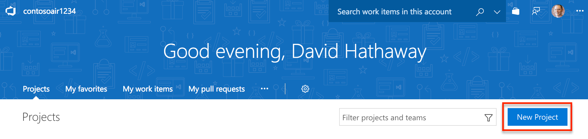

3.  Name the project **ContosoBaggage**, and make sure that **Git** is selected for the **Version** **control**, and **Agile** for the **Work item process** (as shown in the image below).

4.  Select **Create** to create your new project.

    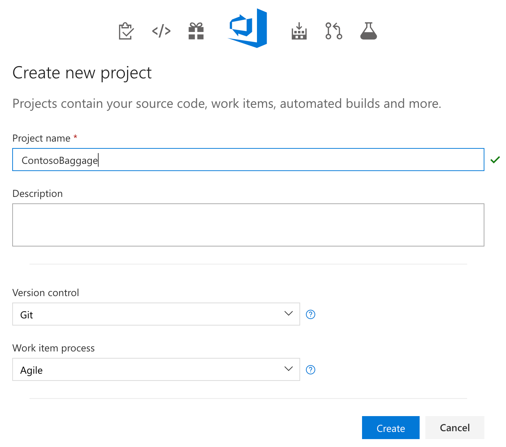

### Task 2: Commit starter project to your VSTS project 

1.  Download the starter code from <http://bit.ly/2F2JQTa>, and extract the project to a new folder.

2.  Execute the following commands in PowerShell (or your favorite git client) to redirect the repository to your Team Services project:

    -   git remote remove origin

    -   git remote add origin

    -   <https://contosoair1234.visualstudio.com/_git/ContosoBaggage>git add -A

    -   git commit -m "Initial commit"

        i.  If the above fails with a message like "Please tell me who you are", then execute the following. Once the following is executed, rerun the git commit command above:

            1.  git config \--global user.email \"you\@example.com\"

            2.  git config \--global user.name \"Your Name\"

    -   git push -u origin --all

**Note**: Make sure to replace the URL in the sample above with the URL to your Git repository. If you are logged into Windows using the same Microsoft account that you're using in Azure and Visual Studio Team Services, then the code will upload. If not, you may be prompted for credentials. If you need to create git credentials:

1.  Browse to the **Code** tab in your Team Services project.

2.  Select the **Clone** button in the upper right hand corner of the code page.

3.  Select the **Generate Git credentials** button, and enter a username/password.

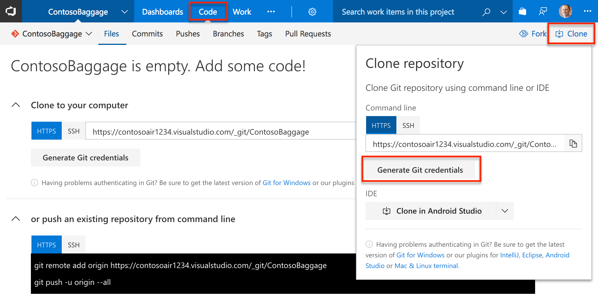

After these steps, you now have a working code base connected to your Visual Studio Team Services project, which will serve as the foundation of your DevOps strategy throughout this lab.

## Exercise 2: Configure Visual Studio App Center

**Duration**: 25 minutes

In this step, we'll explore how quick and easy it is to connect your mobile app to Visual Studio App Center. App Center provides best in class mobile app monitoring, along with a CI, and mobile app testing solution to ensure that any issues in your app are identified and resolve quickly.

### Task 1: Create a new iOS / Xamarin app

1.  Browse to <https://appcenter.ms/apps>

2.  In the top right corner, select **Add New**, and **Add new app**
    
    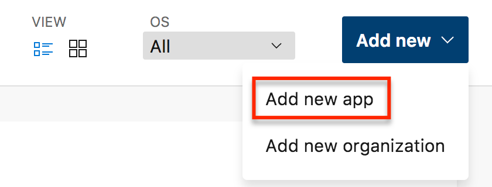
**Note:** If this is your first app in App Center, you may not see this option. Instead, select **Add new app** in the middle of the welcome screen.

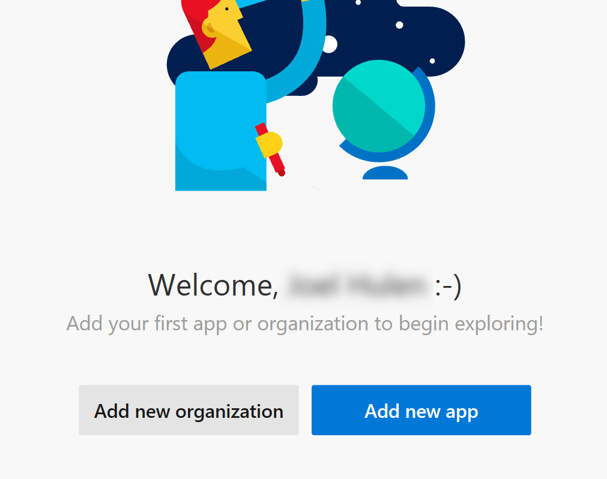

3.  Enter:

    -   App name - A unique name for the app (e.g. **Contoso Baggage \[iOS\]**)

    -   OS - Choose **iOS**

    -   Platform - Choose **Xamarin**

    -   Select the **Add new app** button

    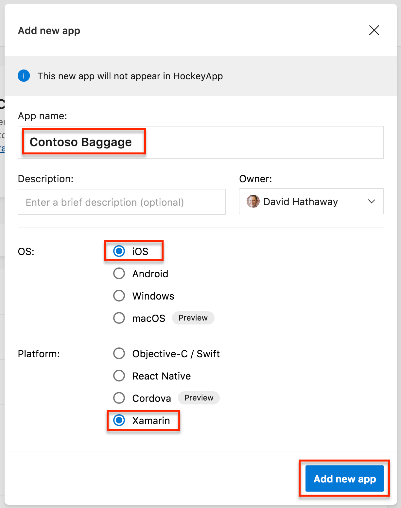

App Center will now create a new instance of your app, including a new key that you'll include in your iOS app.

### Task 2: Connect iOS app to App Center

1.  In the App Center portal, choose the app that you created in the previous task. On the **Getting Started** page, and scroll about half way down, until you find the sample demonstrating how to include the App Secret key. Highlight, and copy the key (shown in the image below).

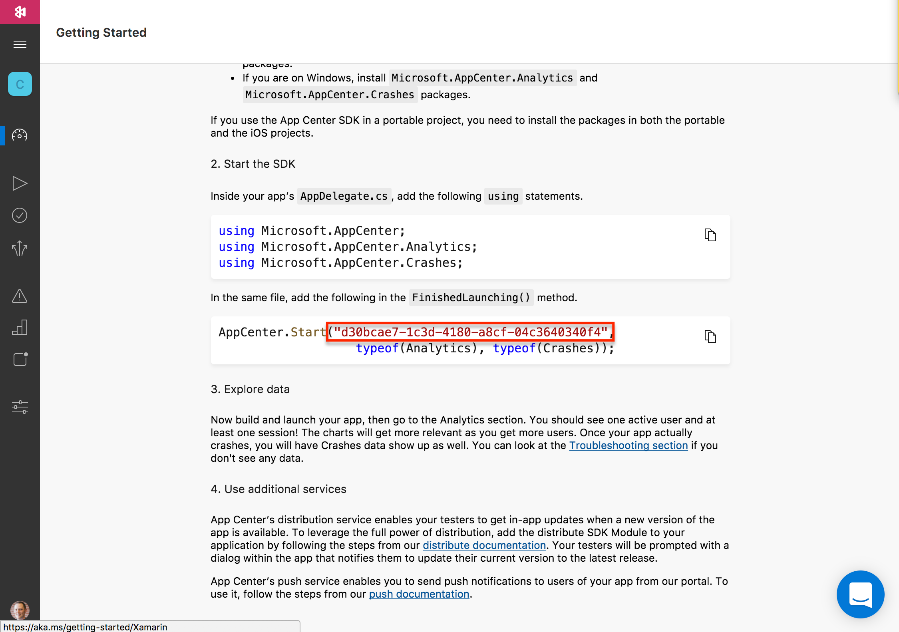

2.  Open the ContosoBaggage Visual Studio solution located in the following directory: **\[%Extracted Lab Files%\]\\src\\ContosoBaggage\\ContosoBaggage.sln**

3.  In Visual Studio, browse to the **ContosoBaggage.iOS** project in the solution tree, and open the **AppDelegate.cs** file.

4.  Locate the **FinishedLaunching()** method, and paste in your app secret key.

5.  Save your changes.

 method")

### Task 3: Create new Android / Xamarin app in Mobile

1.  Browse to <https://appcenter.ms/apps>

2.  In the top right corner, select **Add New**, and **Add new app**

    

3.  Enter:

    -   App name - A name for the app (e.g. **Contoso Baggage \[Android\]**).

    -   OS - Choose **Android**.

    -   Platform - Choose **Xamarin**.

    -   Select the **Add new app** button.

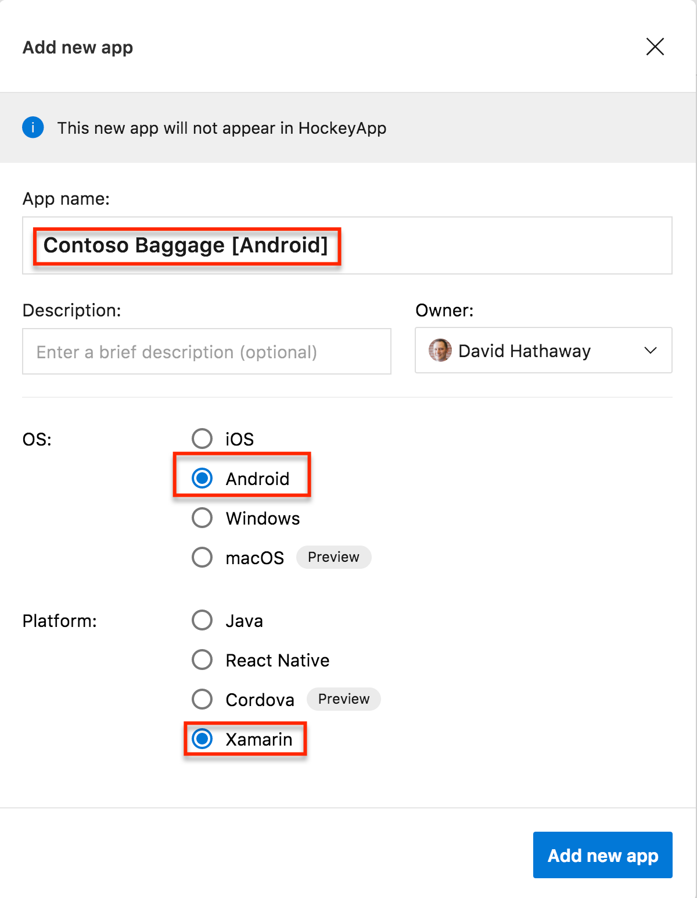

### Task 4: Connect Xamarin.Android app to Mobile Center

1.  In the App Center portal, choose the app that you created in the previous task. On the **Getting Started** page, and scroll about half way down, until you find the sample demonstrating how to include the App Secret key. Highlight, and copy the key (show in the image below).

    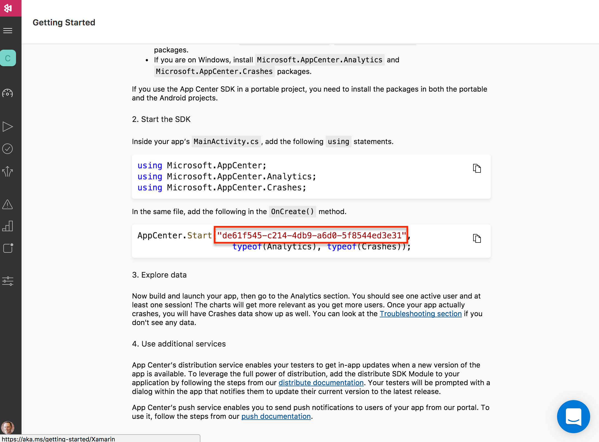

2.  In Visual Studio, browse to the **ContosoBaggage.Droid** project in the solution tree, and open the **MainActivity.cs** file.

3.  Locate the **OnCreate()** method, and paste in your app secret key.

4.  Save your changes.

     method")

### Task 5: Commit your changes to Visual Studio Team Services

1.  In Visual Studio, choose **View \> Team Explorer**.

2.  Select **Changes** to see the files that have changed.

3.  Enter in comments for your commit, then select **Commit All**.

    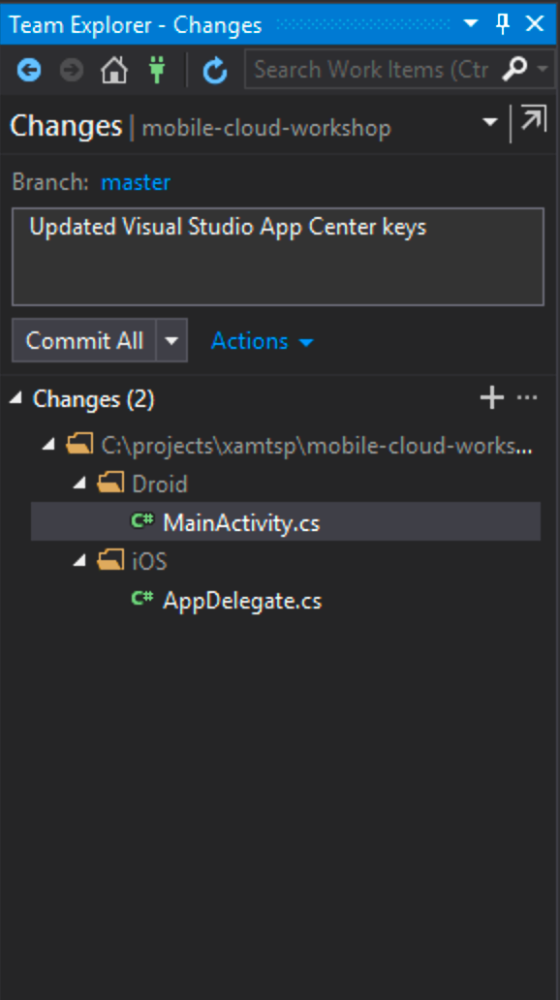

4.  Select **Sync** to push your changes to Visual Studio Team Services.
    
    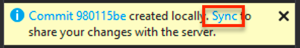

5.  Select the **Sync** button under Synchronization to finish synchronizing your changes.
    
    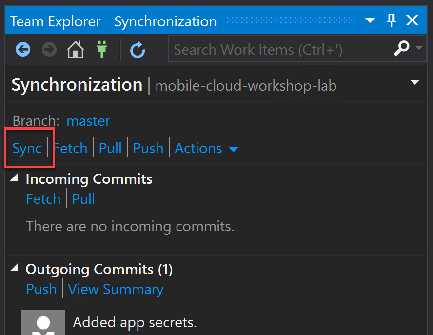

### Task 6: Connect iOS & Android apps in App Center to Team Services and configure/launch build

1.  Navigate to <https://appcenter.ms/apps>, and locate the iOS app you created in the previous steps.

2.  Select the 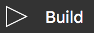 icon in the left-hand menu.

3.  Select **Visual Studio Team Services**.
    
    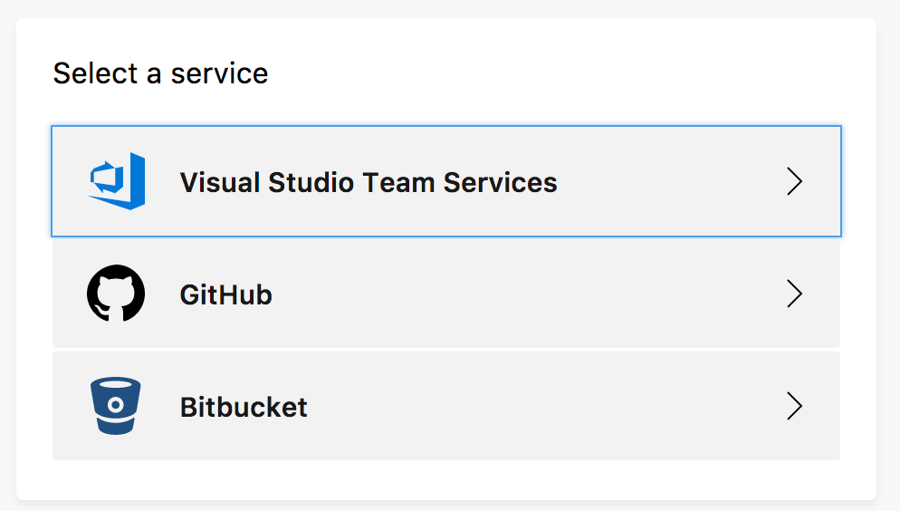

4.  When prompted whether to grant Code (read, write, and manage) permissions to App Center, select **Accept**.
    
    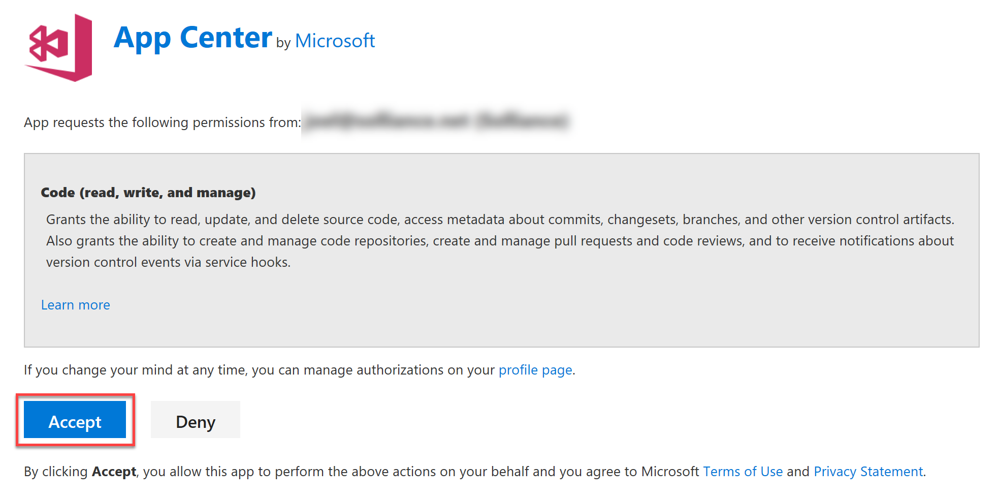

5.  In the resulting dialog, enter **ContosoBaggage**, to reduce the list of projects. Locate your projects and select it.

    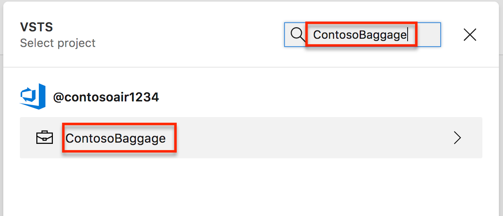

6.  Select the **ContosoBaggage** repository.

    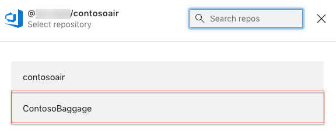

7.  After a quick delay, you should see a list of branches from your repository. Select the **master** branch.

    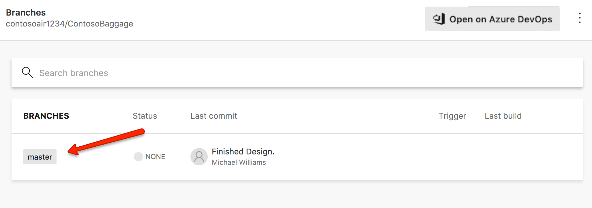

8.  Select the **Configure build** button

    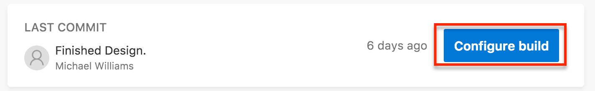

9.  On the **Build configuration** page, select the **ContosoBaggage.iOS.csproj** project, and leave all other defaults.

    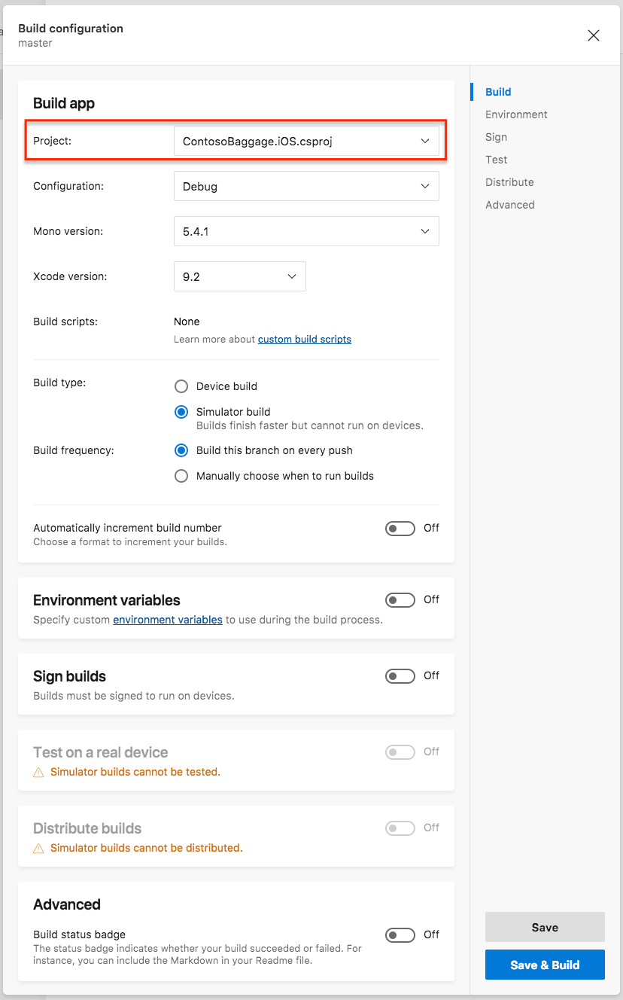

10. Select **Save & Build**.

    This will build a Simulator build of your app, which doesn't require any Apple Developer Certificates. You can execute device builds by checking the "Sign builds" switch, and then attaching a certificate which you can generate at <https://developer.apple.com>. For simplicity of this lab, we won't perform this step.

11. Repeat steps 1 -- 7 for your Android app, and then choose the **ContosoBaggage.Droid.csproj** from your **Project** dropdown.

    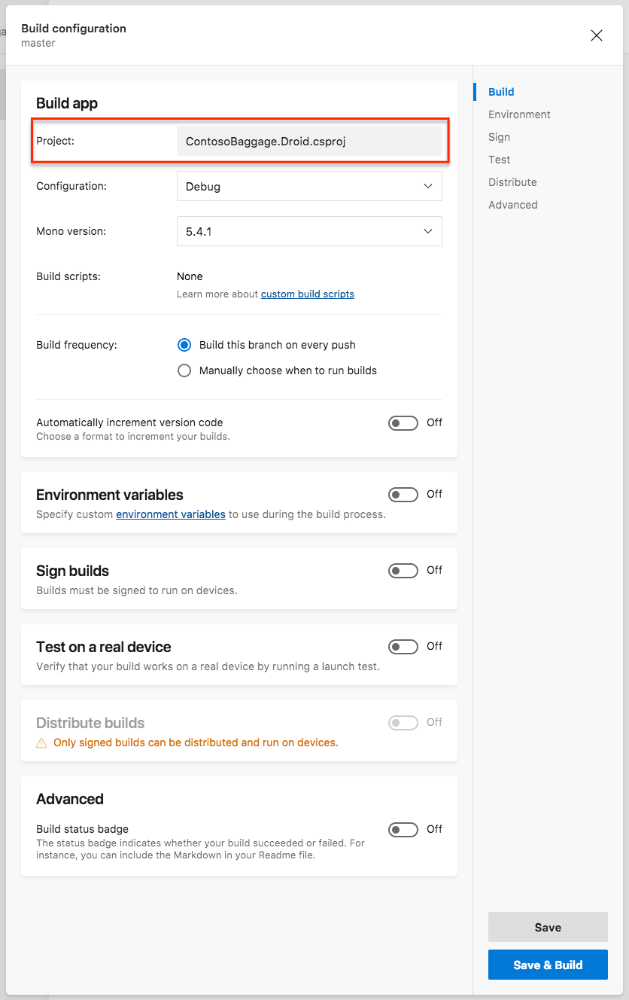

As with the iOS app, the Android app requires a java keystore in order to sign/test/distribute your app. We will not complete this step, but please visit <https://developer.xamarin.com> for details on how to generate a keystore to include in your build.

### Task 7: Enable Telemetry (App Insights in App Center)

One of the most powerful features of Visual Studio App Center, is the ability to connect your analytics data into Application Insights for further slicing and dicing of your data.

1.  In App Center, locate your profile avatar in the bottom left hand corner. Select it, then choose **Account Settings**.

    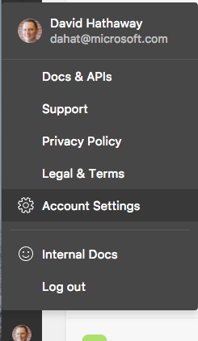

2.  Choose the **Azure** page, to see if you already have an Azure Subscription attached to your account. If you do, you can skip ahead to Step 5. Otherwise, continue with the next step to attach an Azure Subscription.

    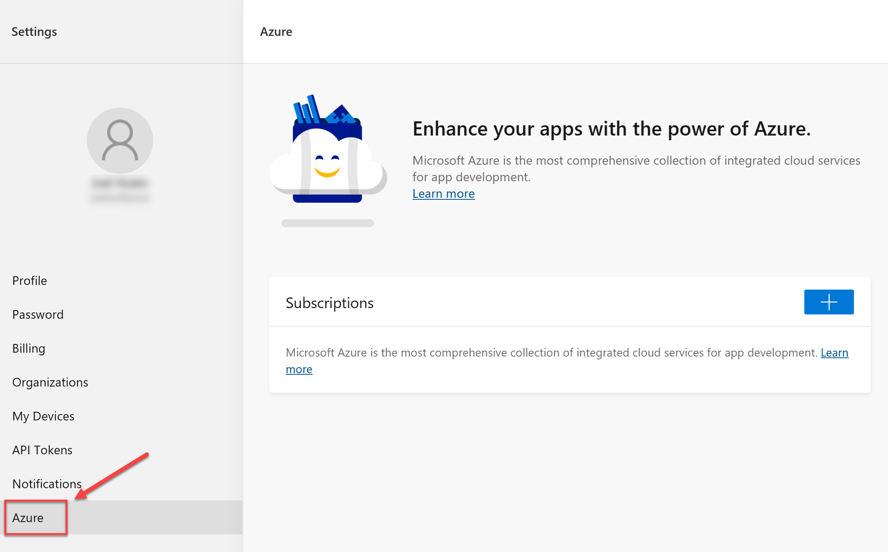

3.  Select the **+** button in the Subscriptions box, and sign in with your Azure Account when prompted.

     button")

4.  Choose one of your available Azure subscriptions, and select **Connect**.

    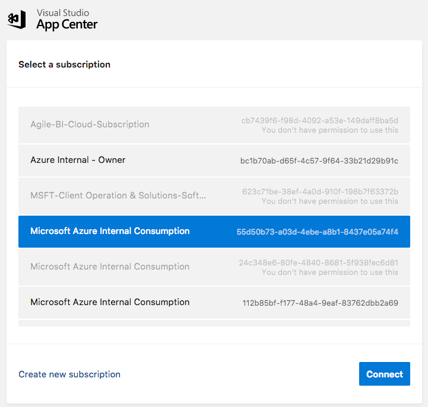

5.  Once connected to your app, select the **Azure Subscription**, and choose **Assign to apps**.

    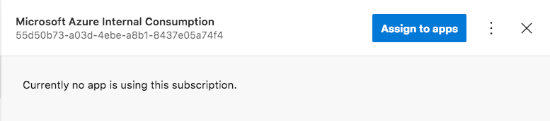

6.  Search for **Contoso Baggage**, and add the iOS app, then select **Assign to apps** again, and attach the subscription to your Android app.

    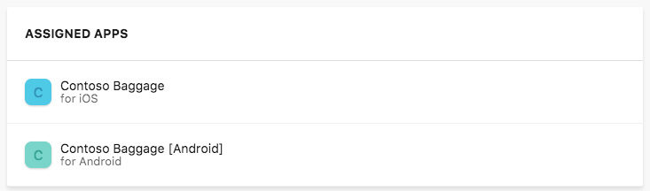

7.  Navigate back to the App Center home page.

8.  Select the iOS app. On the app page, select the 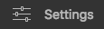 option from the left-hand menu.

9.  Choose **Export**.

    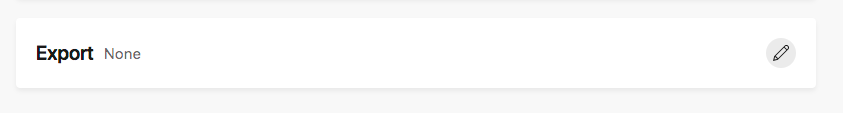

10. Select **+ New Export**.

    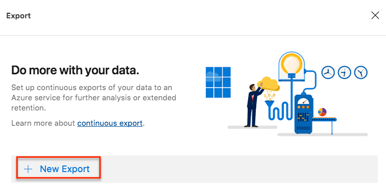

11. Choose **Application Insights**, and select **Set up standard export**.

    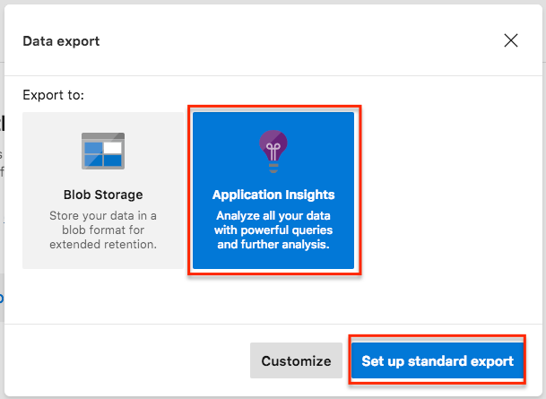

12. When prompted, select **Add to subscription**.

    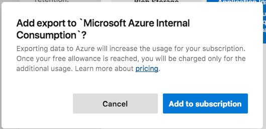

    This will now connect your app to Application Insights, and funnel your analytic data into Application Insights for further post processing using things like the powerful kusto querying language, and creating dashboards, etc.

13. Repeat steps 7 -- 11 for your Android app.

## Exercise 3: Configure Azure Cosmos DB and Azure functions

**Duration**: 30 minutes

Now that we've configured source control, crash reporting, and build steps for our mobile app, we can move on to deploying our backend. For this backend, we're going to leverage Azure Functions, which allows us to turn on micro services that you're only charged for when a call is made. With sub-second billing and multiple trigger options, Functions is a great way to modularize your backend and only pay for exactly the resources you use.

### Task 1: Configure your Cosmos DB instance

1.  Browse to [https://portal.azure.com](https://portal.azure.com/)

2.  In the top left, select **Create Resource \> Databases \>** **Azure Cosmos DB**.

    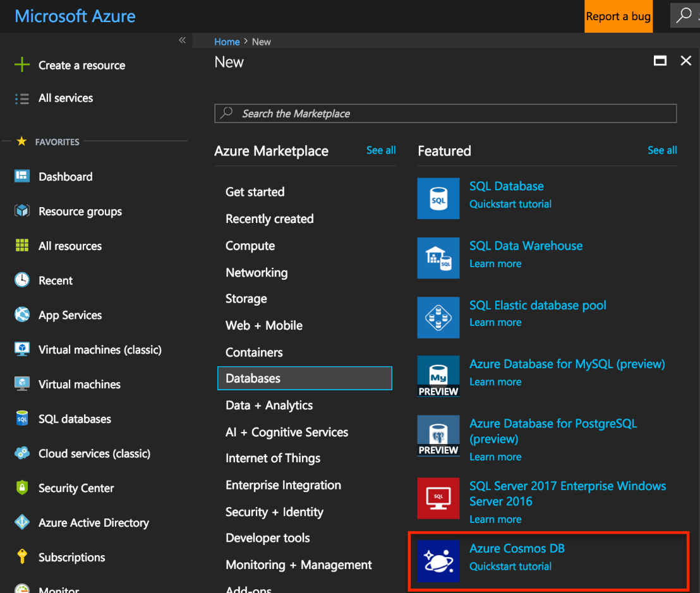

3.  Complete the new resource.

    Give the instance a unique name.

    Choose the **SQL** from the **API** dropdown (this will use DocumentDB under the hood).

    Uncheck enable geo-redundancy.

4.  Select **Create** to create the Cosmos DB instance.

    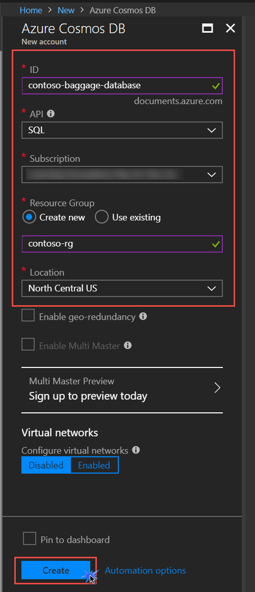

5.  It can take a few minutes before this process completes.

### Task 2: Create collections in your Cosmos DB instance

Now that you've created your cosmos instance, we'll want to create collections for data to be written to.

1.  Browse to your Cosmos DB Instance.

2.  Choose the **Data Explorer** blade from the left-hand menu.

3.  Select the **New Collection** button.

4.  In the Add Collection form, provide the following:

    -   **Database id**: bagDatabase

    -   **Collection id**: FlightCollection

    -   **Storage capacity**: Fixed (10 GB)

    -   **Throughput**: 500

        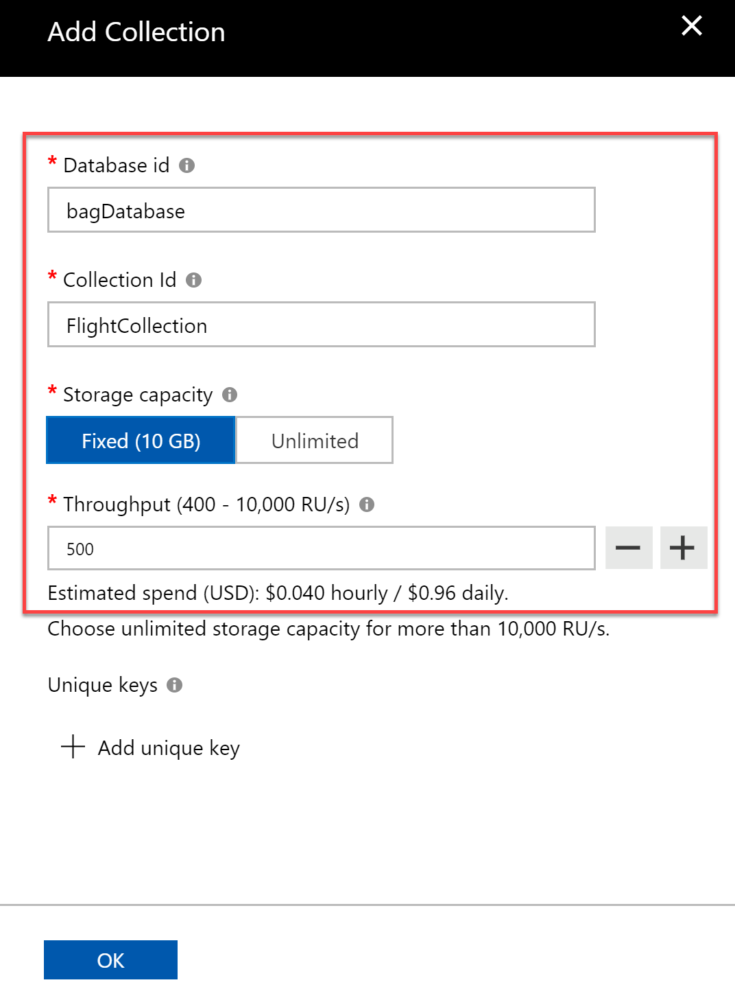

5.  Select **OK**.

6.  Select the **New Collection** button again.

7.  In the Add Collection form, provide the following:

    -   **Database id**: bagDatabase

    -   **Collection id**: BagCollection

    -   **Storage capacity**: Fixed (10 GB)

    -   **Throughput**: 500

        

8.  Select **OK**.

    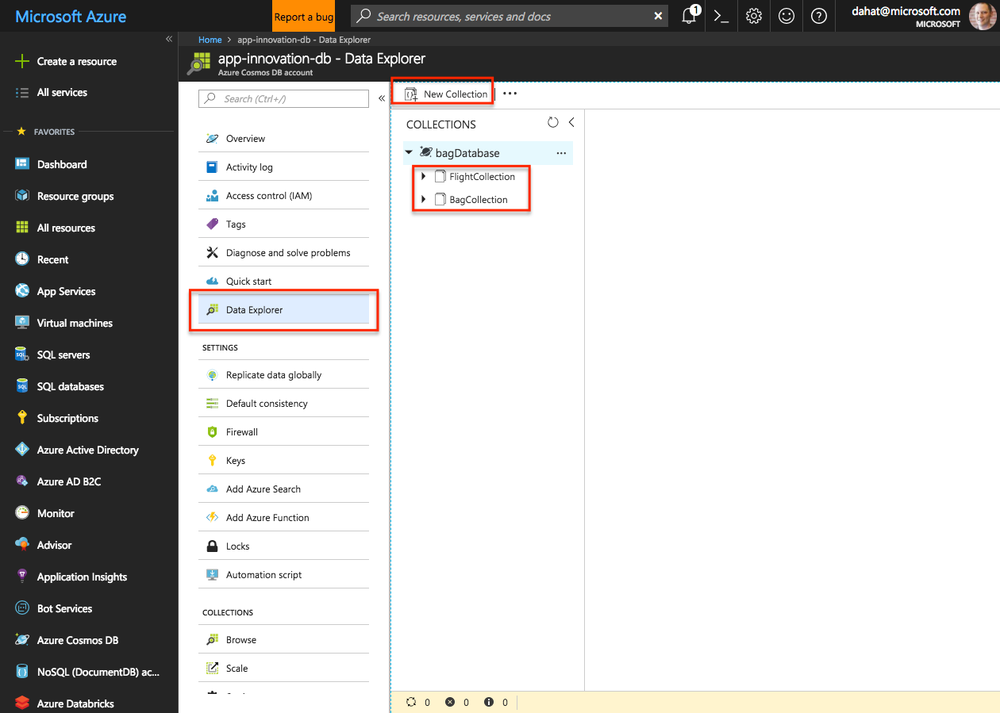

Our Cosmos DB instance is now configured and ready for us to use. We'll come back to this in a little bit when we set up our Functions app to read/write data from the collections.

### Task 3: Create a new Application Insights instance

We are going to use Application Insights to monitor your backend project. In these steps, we will create a new instance of Application Insights to use later in our backend.

1.  Browse to <https://portal.azure.com>

2.  Select **+ Create a resource**.

3.  Choose **Monitoring + Management**.

4.  Choose **Application Insights**.

    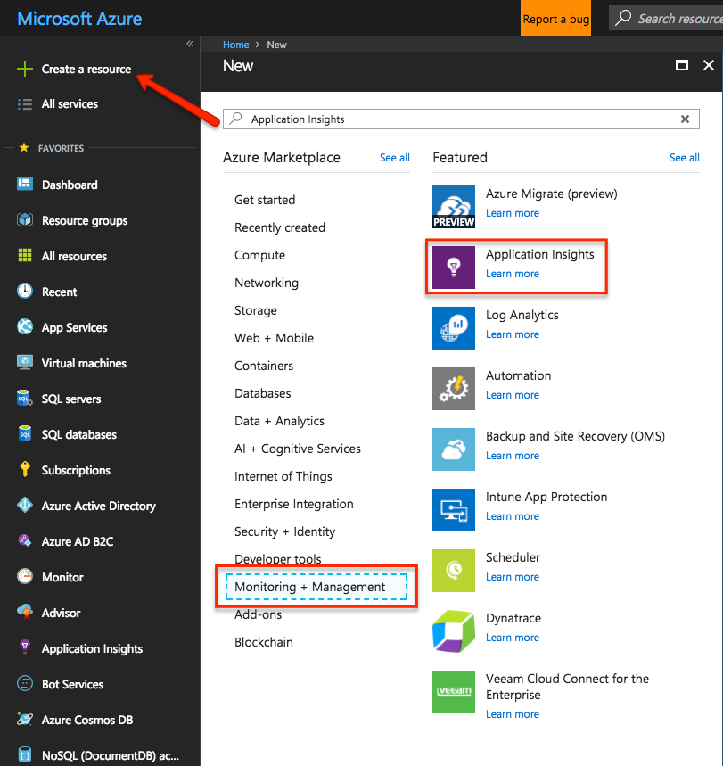

5.  Give your instance a unique name, and choose your Azure subscription to create the instance in.

6.  Choose **ASP.NET web application** as the application type.

7.  Choose the same **resource group** you used for your Cosmos DB instance.

    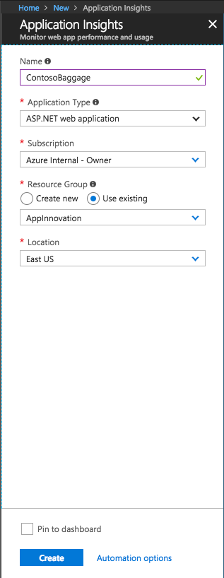

8.  Select **Create** to create your new instance.

### Task 4: Create a new Azure Function App

1.  Browse to [https://portal.azure.com](https://portal.azure.com/)

2.  In the top left, select **Create Resource \> Compute \>** **Function App**.
    
    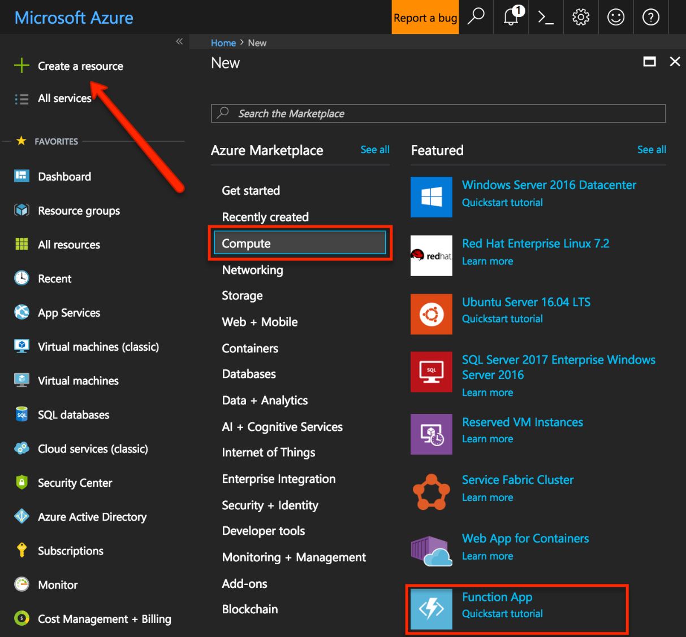

3.  Enter in a name for the app (e.g.**myfunctionsapp** - this must be unique but don't worry, the portal will tell you if it's not).

4.  Add the Function App to the resource group you have been using for this lab.

5.  Complete the new resource. 
    
    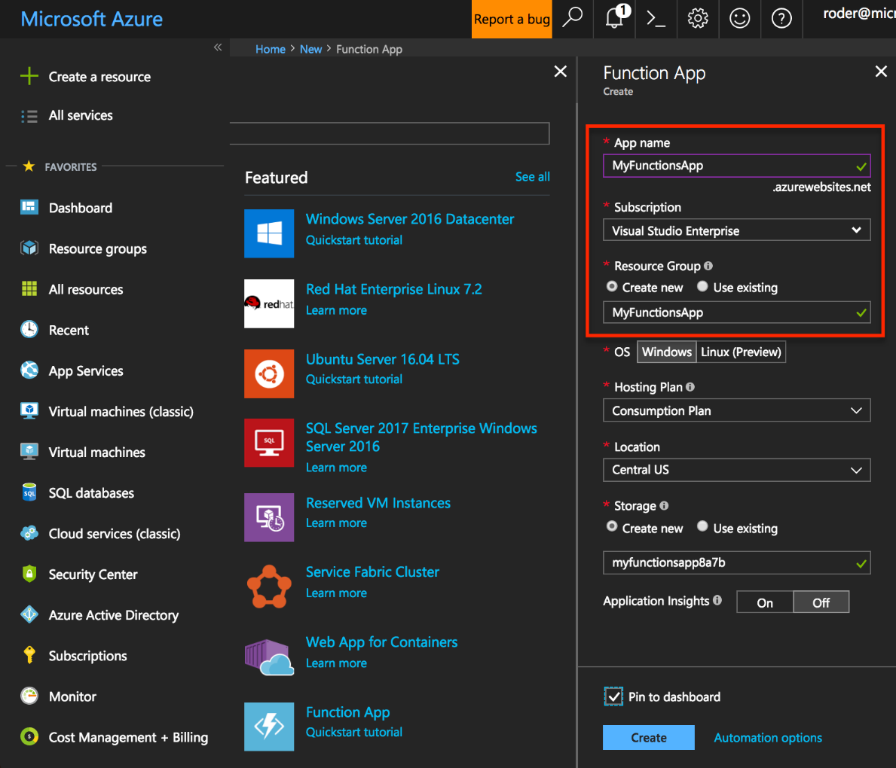

6.  Leave the rest of the settings as default.

7.  Optionally, for easy access, select the **Pin to dashboard** checkbox.

8.  Select **Create** to create your Function App.

9.  It can take a few minutes before this process completes but you should see some notifications updating you on status.

    

10. You can always view all incoming notifications by clicking on the Alert icon in the top toolbar.

    

### Task 5: Connect your Function project to Cosmos DB

1.  In Visual Studio, open the **ContosoBaggage.Backend.Functions.sln** solution from the src/Backend folder where you extracted the lab files.

2.  Under the **ContosoBaggage.Backend.Functions** project, locate the file **Keys.cs**, and open it.

3.  Browse to <https://portal.azure.com>, and locate your Cosmos DB instance.

4.  Select **Keys** from the left-hand menu.

    -   In the Read-write Keys tab, copy the URI and paste it as the value of **URL** within the **Cosmos** class in **Keys.cs**.

    -   In the Read-write Keys tab, copy the Primary Key and paste it as the value of **Key** within the **Cosmos** class in **Keys.cs**.

        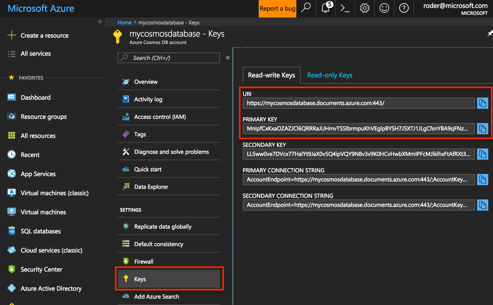

5.  Make sure that your project compiles and launches. If prompted to download the Functions CLI Tools or .NET Framework, select **yes** for both options.
    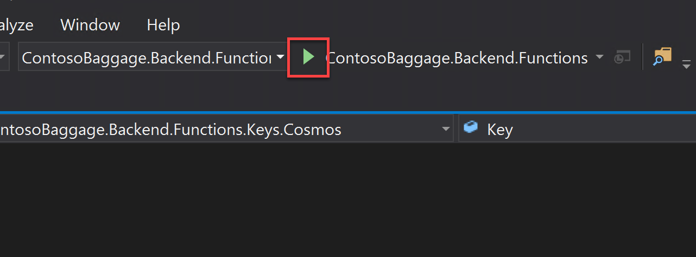

### Task 6: Connect your Project to Application Insights

1.  Browse to <https://portal.azure.com>, and locate your Application Insights instance.

2.  On the Overview blade, copy the Instrumentation Key.
    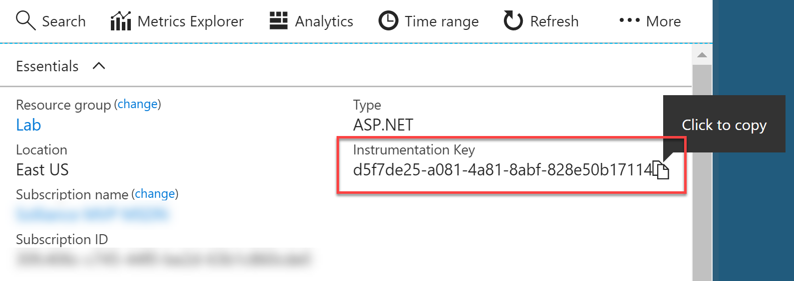

3.  Paste the Instrumentation Key as the value of **Key** within the **Analytics** class in **Keys.cs**.

### Task 7: Add Functions to your app

1.  Right-click on the **Functions** folder in the **ContosoBaggage.Backend.Functions** project.

2.  Choose **Add** \> **New Item**.

3.  Choose Azure Function, then name the class GetBaggageForFlight.cs.

> 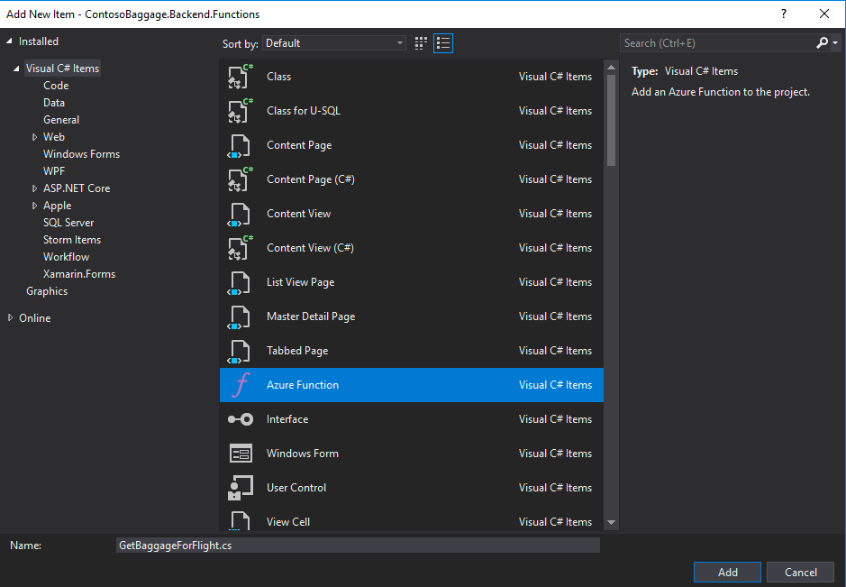

4.  Select **Add**.

5.  In the New Azure Function dialog window, select **Http trigger**, then set the Access rights to **Anonymous**.
    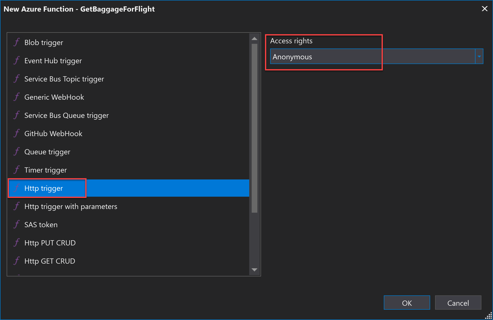

6.  Select **OK**.

7.  Repeat these steps to create 2 additional functions:

    -   GetFlights.cs

    -   ReadIoTScannerMessages.cs

8.  Open **GetBaggageForFlight.cs** and replace the contents with the following code:
    ```
    using System;
    using System.Linq;
    using System.Net;
    using System.Net.Http;

    using Microsoft.ApplicationInsights.DataContracts;
    using Microsoft.Azure.WebJobs;
    using Microsoft.Azure.WebJobs.Extensions.Http;
    using Microsoft.Azure.WebJobs.Host;
    using Microsoft.WindowsAzure.Storage.Table;

    using ContosoBaggage.Backend.Functions.Services;

    namespace ContosoBaggage.Backend.Functions.Functions
    {
        /// <summary>
        /// Get baggage for flight.
        /// </summary>
        public static class GetBaggageForFlight
        {
            /// <summary>
            /// Run the specified req and log.
            /// </summary>
            /// <returns>The run.</returns>
            /// <param name="req">Req.</param>
            /// <param name="log">Log.</param>
            [FunctionName("GetBaggageForFlight")]
            public static HttpResponseMessage Run([HttpTrigger(AuthorizationLevel.Anonymous, "get", 
                                                    Route = nameof(GetBaggageForFlight))]HttpRequestMessage req, 
                                                    TraceWriter log)
            {
                using (var analytic = new AnalyticService(new RequestTelemetry
                {
                    Name = nameof(GetBaggageForFlight)
                }))
                {
                    try
                    {
                        var kvps = req.GetQueryNameValuePairs();
                        var flightNumber = kvps.FirstOrDefault(kvp => kvp.Key == "flightNumber").Value;

                        var baggageForFlight = CosmosDataService.Instance("BagCollection").GetBaggageForFlight(flightNumber);

                        if (baggageForFlight.Count == 0)
                            return req.CreateErrorResponse(HttpStatusCode.NoContent, "No results found for flight");                    

                        return req.CreateResponse(HttpStatusCode.OK, baggageForFlight);
                    }
                    catch (Exception e)
                    {
                        // track exceptions that occur
                        analytic.TrackException(e);
                        return req.CreateErrorResponse(HttpStatusCode.BadRequest, e.Message, e);
                    }
                }
            }
        }
    }

    ```

9.  Open **GetFlights.cs** and replace the contents with the following code:
    ```
    using System;
    using System.Linq;
    using System.Net;
    using System.Net.Http;
    using System.Threading.Tasks;

    using Microsoft.ApplicationInsights.DataContracts;
    using Microsoft.Azure.WebJobs;
    using Microsoft.Azure.WebJobs.Extensions.Http;
    using Microsoft.Azure.WebJobs.Host;

    using ContosoBaggage.Backend.Functions.Services;

    namespace ContosoBaggage.Backend.Functions.Functions
    {
        public static class GetFlights
        {
            [FunctionName("GetFlights")]
            public static async Task<HttpResponseMessage> Run([HttpTrigger(AuthorizationLevel.Anonymous, "get", Route = nameof(GetFlights))]HttpRequestMessage req, TraceWriter log)
            {
                using (var analytic = new AnalyticService(new RequestTelemetry
                {
                    Name = nameof(GetFlights)
                }))
                {
                    try
                    {
                        var flights = CosmosDataService.Instance("FlightCollection").GetFlights();
                        
                        return req.CreateResponse(HttpStatusCode.OK, flights);
                    }
                    catch (Exception e)
                    {
                        // track exceptions that occur
                        analytic.TrackException(e);
                        return req.CreateErrorResponse(HttpStatusCode.BadRequest, e.Message, e);
                    }
                }
            }
        }
    }

    ```

10. Open **ReadIoTScannerMessages.cs** and replace the contents with the following code:
    ```
    using ContosoBaggage.Backend.Functions.Services;
    using ContosoBaggage.Common.Models;
    using Microsoft.ApplicationInsights.DataContracts;
    using Microsoft.Azure.WebJobs;
    using Microsoft.Azure.WebJobs.Host;
    using Microsoft.Azure.WebJobs.ServiceBus;
    using Newtonsoft.Json;
    using Newtonsoft.Json.Linq;
    using System;
    using System.Collections.Generic;
    using System.Linq;
    using System.Threading.Tasks;

    namespace ContosoBaggage.Backend.Functions.Functions
    {
        public static class ReadIoTScannerMessages
        {
            [FunctionName("ReadIoTScannerMessages")]
            public async static void Run([EventHubTrigger("appinnovationhub", Connection = "EventHub")]string myEventHubMessage, TraceWriter log)
            {
                using (var analytic = new AnalyticService(new RequestTelemetry
                {
                    Name = nameof(ReadIoTScannerMessages)
                }))
                {
                    try
                    {
                        log.Info($"C# Event Hub trigger function processed a message: {myEventHubMessage}");

                        BaggageItem baggageItem = JsonConvert.DeserializeObject<BaggageItem>(myEventHubMessage);

                        // Check if the event hub message id is the same as an item already in the database. 
                        // If yes, update that record, if not, create a new record
                        var baggageForFlight = CosmosDataService.Instance("BagCollection").GetBaggageForFlight(baggageItem.FlightNumber);
                        var matches = baggageForFlight.Where(b => String.Equals(b.Id, baggageItem.Id)).ToList();

                        if ((baggageForFlight != null) && (matches.Count != 0))
                        {
                            await CheckIfBagAlreadyExists(baggageForFlight, baggageItem);
                        }
                        else
                        {
                            Console.WriteLine("No matches found. The database is likely corrupt. " +
                            "Try deleting the collections in the database and running setup in the IOTHubGettingStarted Project under Program.exe");
                        }
                    }
                    catch (Exception e)
                    {
                        // track exceptions that occur
                        analytic.TrackException(e);
                    }
                }
            }

            public static async Task CheckIfBagAlreadyExists(List<BaggageItem> baggageForFlight, BaggageItem baggageItem)
            {
                // If the baggage has the same status, return, otherwise update its status
                if (baggageForFlight.Contains(baggageItem))
                {
                    return;
                }
                else
                {
                    await CosmosDataService.Instance("BagCollection").UpdateItemAsync(baggageItem);
                }
            }
        }
    }

    ```

### Task 8: Deploy your app to Azure

1.  Right-click on your Functions project and select **Publish.**

2.  Select **Azure Function App** and select **Existing**.

3.  Select the Settings icon and select **Create Profile**.

4.  Select the **Create Profile** button.

    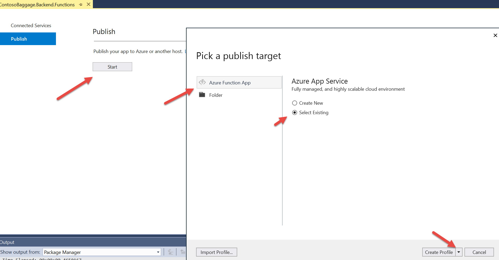

5.  Select your Azure Subscription from the dropdown.

6.  Expand the Resource Group and select the Function App you created in the previous tasks.

7.  Select **OK**.

    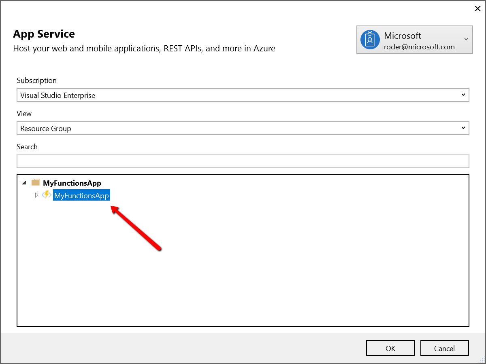

If you plan to attach a remote debugger, you'll need to perform one additional step here to make sure your code is compiled with Debug symbols. Do not complete these steps for production workloads. These are only appropriate for development.

1.  Select **Settings**.

    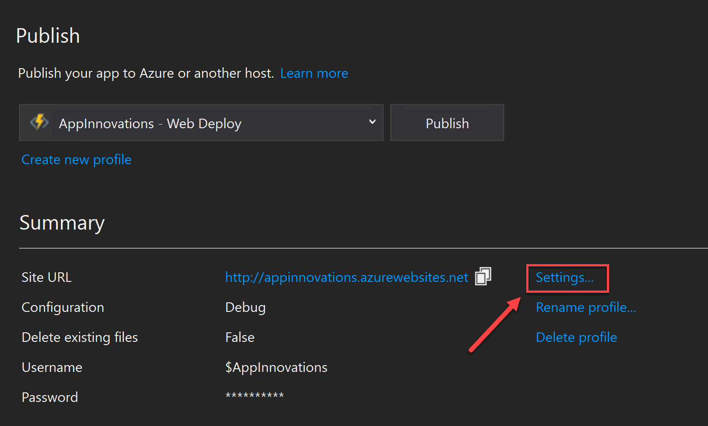

2.  Change the Configuration to **Debug** and select **Save**.

    

3.  Select the **Publish** button.

If you get a warning indicating the version remotely doesn\'t match the local version, accept by clicking **Yes**.

4.  Copy the site URL and verify the function is running by using Postman to send that same GET request against the remote instance (e.g. http://myfunctionsapp.azurewebsites.net/api/GetFlights) and verify that you get a successful response (i.e. status code 200 OK). There will be no data yet since we haven't populated the databases, but this will at least confirm that your project is deployed successfully and running in Azure with no errors. If you don't have Postman installed, you can simply browse to the path in a new browser window. You should see an output displaying an XML tag similar to the following: \<ArrayOfFlight xmlns:i=\"http://www.w3.org/2001/XMLSchema-instance\" xmlns=\"http://schemas.datacontract.org/2004/07/ContosoBaggage.Common.Models\"/\>

    

## Exercise 4: Set up IoT hub 

**Duration**: 20 minutes

Azure IoT Hub is a fully managed Azure service. This service enables reliable and secure bi-directional communications between millions of Internet of Things (IoT) devices and a solution back end. One of the biggest challenges that IoT projects face is how to reliably and securely connect devices to the solution back end. To address this challenge, IoT Hub:

1.  Offers reliable device-to-cloud and cloud-to-device hyper-scale messaging.

2.  Enables secure communications using per-device security credentials and access control.

3.  Includes device libraries for the most popular languages and platforms.

This tutorial shows you how to:

1.  Use the Azure portal to create an IoT hub.

2.  Create a device identity in your IoT hub.

3.  Create a simulated RFID device sends messages to your IoT Hub.

In this task you will find three projects:

1.  **CreateDeviceIdentity**, which creates a device identity and associated security key to connect your device app.

2.  **SimulatedDevice**, which connects to your IoT hub with the device identity created earlier, and sends a telemetry message every second by using the MQTT protocol.

3.  **Telemetry**, which if you opt- in Microsoft will get usage about how you use IoT Hub.

### Task 1: Create the IoT hub in Azure

Create an IoT Hub for your simulated device app to connect to. The following steps show you how to complete this task by using the Azure portal.

1.  Sign in to the [Azure portal](https://portal.azure.com/).

2.  Select **New \>** **Internet of Things \> IoT Hub**.

    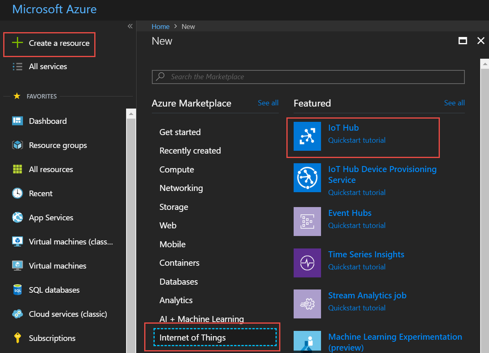

3.  In the **IoT hub** pane, enter the following information for your IoT hub:

    -   **Name**: Create a name for your IoT hub. If the name you enter is valid, a green check mark appears.

    -   **Important:** The IoT hub will be publicly discoverable as a DNS endpoint, so make sure to avoid any sensitive information while naming it.

    -   **Pricing and scale tier**: For this tutorial, select the **F1 - Free** tier. For more information, see the [Pricing and scale tier](https://azure.microsoft.com/pricing/details/iot-hub/).

    -   **Resource group**: Select the same resource group you have been using for this lab.

    -   **Location**: Select the closest location to you.

    -   **Pin to dashboard**: Check this option for easy access to your IoT hub from the dashboard.

        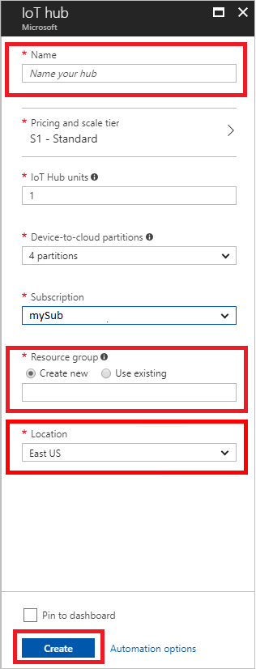

4.  Select **Create**. Your IoT hub might take a few minutes to create. You can monitor the progress in the **Notifications** pane.

5.  When your new IoT hub is ready, select its tile in the Azure portal to open its properties window. Now that you have created an IoT hub, locate the important information that you use to connect devices and applications to your IoT hub. Make a note of the **Hostname**, and then select **Shared access policies**.

    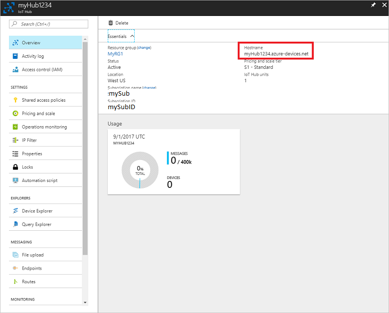

6.  In **Shared access policies**, select the **iothubowner** policy, and then make note of the IoT Hub connection string in the **iothubowner** window. For more information, see [Access control](https://docs.microsoft.com/en-us/azure/iot-hub/iot-hub-devguide-security) in the \"IoT Hub developer guide."

    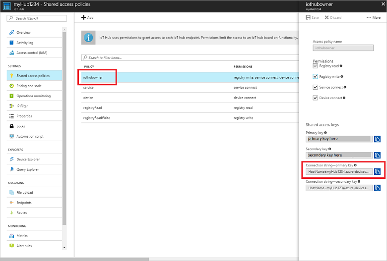

You have now created your IoT hub, and you have the host name and IoT Hub connection string that you need to complete the rest of this tutorial.

### Task 2: Create a device identity

In this task, you will create a .NET console app that creates a device identity in the identity registry in your IoT hub. A device cannot connect to IoT hub unless it has an entry in the identity registry. For more information, see the \"Identity registry\" section of the [IoT Hub developer guide](https://docs.microsoft.com/en-us/azure/iot-hub/iot-hub-devguide-identity-registry). When you run this console app, it generates a unique device ID and key. Your device uses these values to identify itself when it sends device-to-cloud messages to IoT Hub. Device IDs are case-sensitive.

1.  In Visual Studio, open the **IoTHubGetStarted.sln** solution from the src/IoTSimulator folder where you extracted the lab files.

2.  Expand the **CreateDeviceIdentity** project, then open the **Program.cs** file.

3.  Locate the **ConnectionString** variable on line 13 and paste your IoTHub connection string for the iothubowner policy you copied in the previous task.

    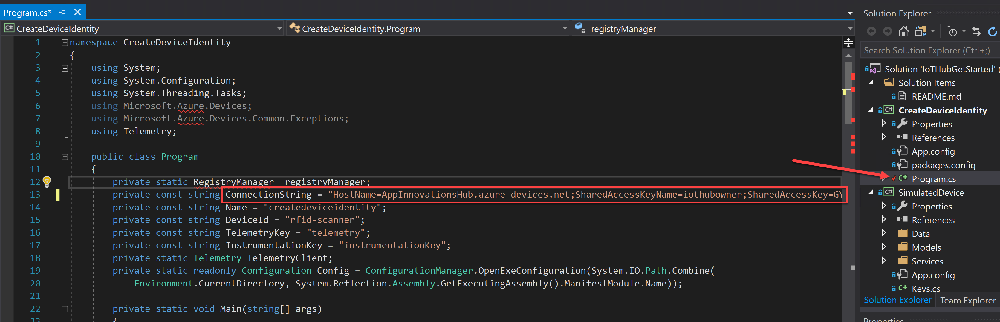

4.  Save your changes and run the CreateDeviceIdentity program, then make a note of the device key.

    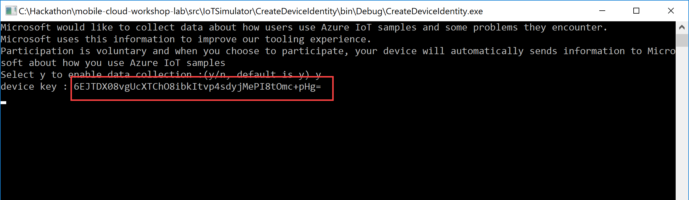

**Note:**

The IoT Hub identity registry only stores device identities to enable secure access to the IoT hub. The identity registry stores device IDs and keys to use as security credentials. The identity registry also stores an enabled/disabled flag for each device that you can use to disable access for that device. If your application needs to store other device-specific metadata, it should use an application-specific store. For more information, see [IoT Hub developer guide](https://docs.microsoft.com/en-us/azure/iot-hub/iot-hub-devguide-identity-registry).

### Task 3: Set up the backend keys for the database and Functions

Part 1: Database and Application Insights Keys

1.  Under the **SimulatedDevice** project, open the **Keys.cs** file.

2.  Browse to <https://portal.azure.com>, and locate your Cosmos DB instance.

3.  Select **Keys** from the left-hand menu.

    -   In the Read-write Keys tab, copy the URI and paste it as the value of **URL** within the Cosmos class in **Keys.cs**.

    -   In the Read-write Keys tab, copy the Primary Key and paste it as the value of **Key** within the Cosmos class in **Keys.cs**.
        
        

4.  Browse to <https://portal.azure.com>, and locate your Application Insights instance.

5.  On the Overview blade, copy the Instrumentation Key.
    
    

-   Paste the Instrumentation Key as the value of **Key** within the **Analytics** class in **Keys.cs**.

6.  Save your changes.

Part 2: Function URL

1.  Under the **SimulatedDevice** project, locate the **Services** folder and open file **FlightService.cs**.

2.  Browse to <https://portal.azure.com>, and locate your Azure Functions instance.

3.  In the Overview blade, locate the URL of your function.
    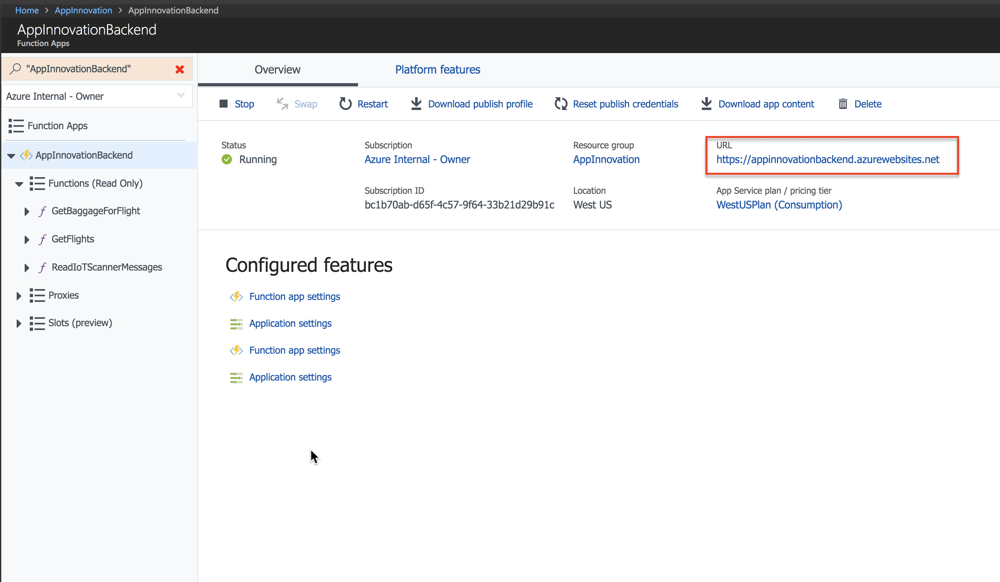

4.  Copy and paste that value into the base URL (line 17). Be sure to keep the {0} on the end of the string.
    ```
    string \_baseUrl = \"https://your-function-url-here.azurewebsites.net{0}\";
    ```

### Task 4: Set up the program to scan the bags

1.  In the IoTHubGetStarted Visual Studio project, open **Program.cs** within the **SimulatedDevice** project. Update the **Program** class with the following:

    -   Substitute {iot hub hostname} with the IoT hub host name you retrieved in the \"Create an IoT hub\" section.

    -   Substitute {device key} with the device key you retrieved in the \"Create a device identity\" section.
    ```
        static  DeviceClient  deviceClient;

        static  string  iotHubUri  =  "{iot hub hostname}";

        static  string  deviceKey  =  "{device key}";
    ```

2.  By default, the **Create** method in a .NET Framework app creates a **DeviceClient** instance that uses the AMQP protocol to communicate with IoT Hub. To use the MQTT or HTTPS protocol, use the override of the **Create** method that enables you to specify the protocol. UWP and PCL clients use the HTTPS protocol by default. If you use the HTTPS protocol, you should also add the **Microsoft.AspNet.WebApi.Client** NuGet package to your project to include the **System.Net.Http.Formatting** namespace.

### Task 5: Run the program to scan the bags

1.  Around line 35 enter in the Flight that you would like to update the bags for:

```
static string myFlightNumber = "FL1234";
```

2.  Run the **SimulatedDevice** project. You should see the bags updating in the Console app. The backend might take a few minutes to set up.

    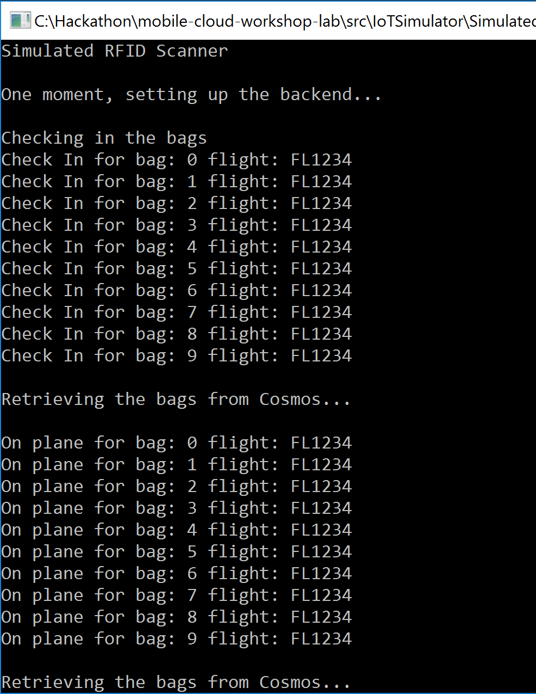

3.  The **Usage** tile in the [Azure portal](https://portal.azure.com/) shows the number of messages sent to the IoT hub:

    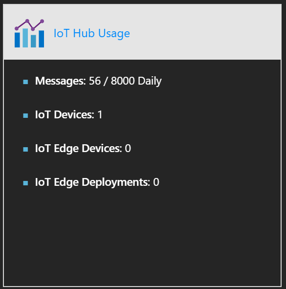

## Exercise 5: Connect the mobile app to the backend

**Duration**: 30 minutes

Now that we've configured backend and populated it with data, we'll configure our mobile app to be able to consume the data from our Functions.

### Task 1: Connect app to Azure backend

1.  Browse to <https://portal.azure.com>, and locate your Functions app that you created in Exercise 3 above.

2.  On the Overview blade, locate the URL for your function app. Copy the URL.

    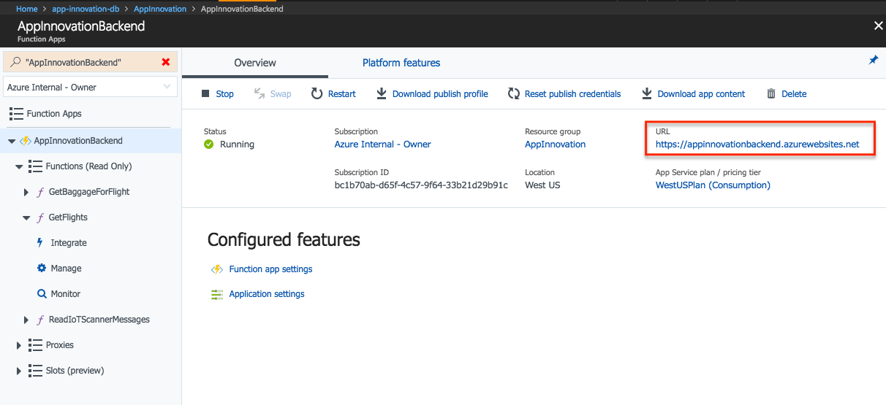

3.  Open the **ContosoBaggage.sln** solution from your /src/ContosoBaggage folder of your project.

4.  Expand the **ContosoBaggage** project and locate the **FlightService.cs** file under the Services folder.

5.  Locate the variable \_**baseUrl** (it should be somewhere around line \#23).

6.  Paste the URL that you copied in Step 2 above, into the \_**baseUrl** variable. Make sure to preserve the {0} at the end of the URL. The code later on uses **string.Format()** to add a specific function call.
    
    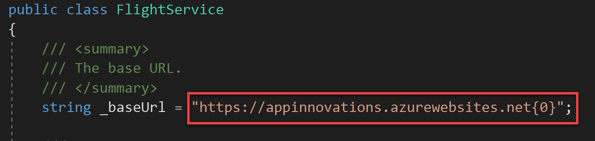

### Task 2: Create a Flight List page

1.  Locate the Pages folder in the ContosoBaggage project.

2.  Right-click the folder, then choose **Add \> New Item**.

    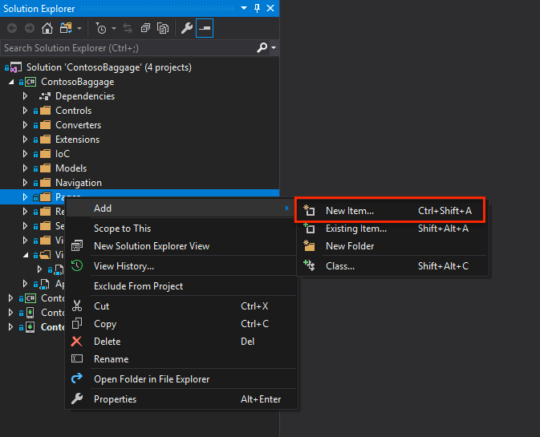

3.  Choose **Xamarin.Forms \> Content Page** and name the page **FlightListPage.xaml**.

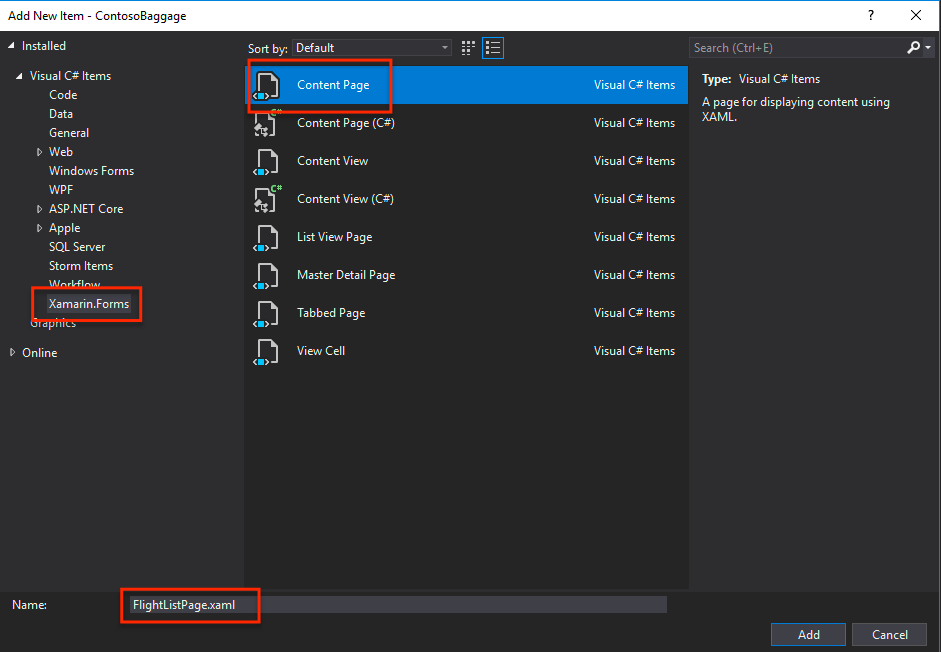

4.  Select **Add**.

5.  Replace the contents of FlightListPage.xaml with the following:
    ```
    <?xml version="1.0" encoding="UTF-8"?>
    <pages:BaseContentPage 
        xmlns="http://xamarin.com/schemas/2014/forms" 
        xmlns:x="http://schemas.microsoft.com/winfx/2009/xaml"
        x:Class="ContosoBaggage.Pages.FlightDetailsPage"
        xmlns:controls="clr-namespace:ContosoBaggage.Controls;assembly=ContosoBaggage"
        xmlns:pages="clr-namespace:ContosoBaggage.Pages;assembly=ContosoBaggage"
        xmlns:views="clr-namespace:ContosoBaggage.Views;assembly=ContosoBaggage"
        xmlns:viewmodels="clr-namespace:ContosoBaggage.ViewModels;assembly=ContosoBaggage"
        x:TypeArguments="viewmodels:FlightDetailsViewModel"
        Title="{Binding Title}"
        BackgroundColor="#EFEEF5">    
        <pages:BaseContentPage.Content>
            <Grid RowSpacing="0">
                <Grid.RowDefinitions>
                    <RowDefinition Height="Auto" />
                    <RowDefinition Height="130" />
                    <RowDefinition Height="300" />
                    <RowDefinition Height="*" />
                </Grid.RowDefinitions>
                <views:NavigationBar
                    CanMoveBack="true"
                    Title="Add Treasure"
                    BackgroundColor="White"/>
                <Image Source="header_other.jpg"
                    Aspect="AspectFill"
                    Grid.Row="1"/>
                <BoxView BackgroundColor="{StaticResource gray}"
                    Grid.Row="1"
                    Opacity="0.3"/>
                <StackLayout Orientation="Vertical"
                    Padding="10, 10, 10, 10"
                    Spacing="15"
                    Grid.Row="1">                
                    <Label x:Name="FlightNumberLabel"
                        Text="{Binding FlightNumber}"
                        TextColor="White"
                        HorizontalTextAlignment="Center"
                        FontSize="30"/>
                    <Label x:Name="FlightsLabel"
                        Text="{Binding TotalBagsOnFlight, StringFormat='{0} bags on flight'}"
                        TextColor="White"
                        HorizontalTextAlignment="Center"
                        FontSize="Large"/>                
                </StackLayout>            
                <ActivityIndicator 
                    Grid.Row="2"
                    HorizontalOptions="Center"
                    VerticalOptions="Center"
                    IsVisible="{Binding IsBusy}"
                    IsRunning="{Binding IsBusy}"
                    Color="{StaticResource gray}"/>
                <controls:DataTemplatePresenter ItemTemplate="{StaticResource flightDetailsView}"
                    IsVisible="{Binding IsBusy, Converter={StaticResource notConverter}}"
                    Grid.Row="2">
                    <controls:DataTemplatePresenter.GestureRecognizers>
                        <TapGestureRecognizer Command="{Binding FlightsCommand}"/>
                    </controls:DataTemplatePresenter.GestureRecognizers>
                </controls:DataTemplatePresenter>
                <ListView x:Name="bagsListView"
                    IsVisible="{Binding IsBusy, Converter={StaticResource notConverter}}"
                    ItemsSource="{Binding BagsForFlight}"
                    CachingStrategy="RetainElement"
                    SeparatorVisibility="None"
                    RowHeight="80"
                    Grid.Row="3">
                    <ListView.Behaviors>
                        <controls:EventToCommandBehavior EventName="ItemTapped" 
                            Command="{Binding BagSelectedCommand}" 
                            EventArgsConverter="{StaticResource ItemTappedConverter}" />
                    </ListView.Behaviors>                
                    <ListView.ItemTemplate>
                        <DataTemplate>
                            <ViewCell>
                                <controls:DataTemplatePresenter 
                                ItemTemplate="{StaticResource bagDetailsView}"/>
                            </ViewCell>
                        </DataTemplate>
                    </ListView.ItemTemplate>
                </ListView>            
            </Grid>
        </pages:BaseContentPage.Content>
    </pages:BaseContentPage >
    ```

### Task 3: Create a Flight List View Model

1.  Right-click on the ViewModels folder in the ContosoBaggage project, and choose **Add \> New Item**.

2.  Choose C\# Class file, and name it **FlightListViewModel.cs**.

    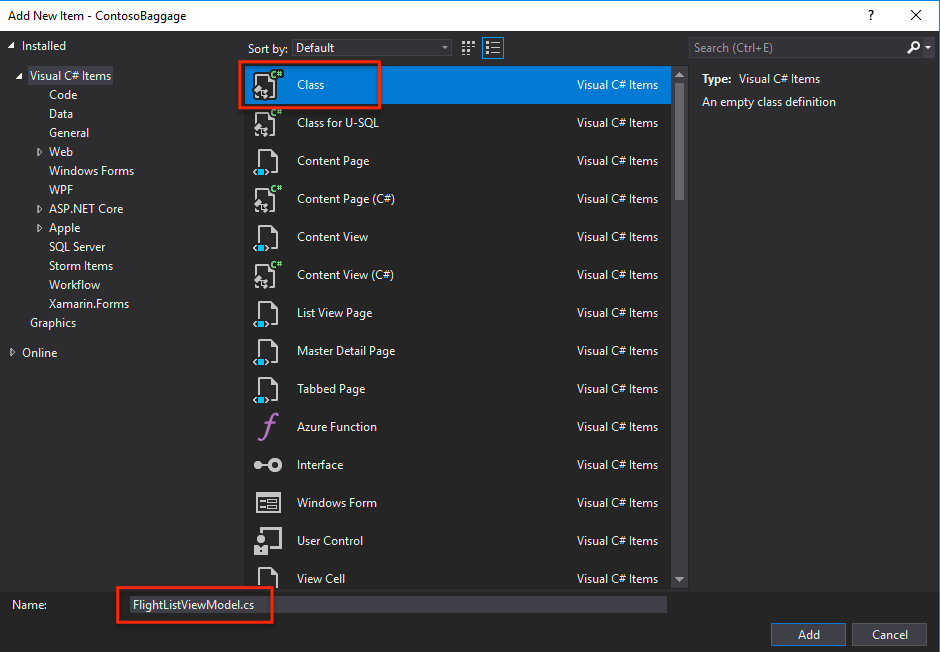

3.  Replace the contents of the file with this code:
    ```
    using System;
    using System.Collections.Generic;
    using System.Collections.ObjectModel;
    using System.Linq;
    using System.Threading.Tasks;
    using System.Windows.Input;

    using Xamarin.Forms;

    using Microsoft.AppCenter.Analytics;

    using ContosoBaggage.Common.Models;
    using ContosoBaggage.Services;
    using ContosoBaggage.Controls;
    using ContosoBaggage.Navigation;
    using ContosoBaggage.Models;

    namespace ContosoBaggage.ViewModels
    {
        /// <summary>
        /// Flight list view model.
        /// </summary>
        public class FlightListViewModel : BaseViewModel
        {
            /// <summary>
            /// Gets or sets the flights.
            /// </summary>
            /// <value>The flights.</value>
            public ObservableCollection<Flight> Flights { get; set; }

            /// <summary>
            /// The flight selected command.
            /// </summary>
            Command _flightSelectedCommand;

            /// <summary>
            /// Gets the flight selected command.
            /// </summary>
            /// <value>The flight selected command.</value>
            public Command FlightSelectedCommand
            {
                get => _flightSelectedCommand ?? (_flightSelectedCommand = new Command<Flight>((obj) => GoToPage(PageNames.FlightDetailsPage,
                                                            new NavigationParameters()
                {
                    {"flight", obj}
                })));
            }

            /// <summary>
            /// The get flights command.
            /// </summary>
            Command _getFlightsCommand;

            /// <summary>
            /// Gets the get flights command.
            /// </summary>
            /// <value>The get flights command.</value>
            public Command GetFlightsCommand
            {
                get => _getFlightsCommand ??
                (_getFlightsCommand = new Command(async () => await ExecuteGetFlightsCommand(), 
                                                () => { return !IsBusy; }));
            }

            /// <summary>
            /// Executes the get flights command.
            /// </summary>
            /// <returns>The get flights command.</returns>
            private async Task ExecuteGetFlightsCommand()
            {
                if (IsBusy)
                    return;
                
                IsBusy = true;
                GetFlightsCommand.ChangeCanExecute();
                try
                {
                    Flights.Clear();

                    var flights = await FlightService.GetFlights();
                    foreach (var flight in flights.OrderByDescending(x => x.FlightDate))
                    {
                        Flights.Add(flight);
                    }
                }
                catch (Exception ex)
                {
                    Analytics.TrackEvent("Exception", new Dictionary<string, string> {
                        { "Message", ex.Message },
                        { "StackTrace", ex.ToString() }
                    });
                }
                finally
                {
                    IsBusy = false;
                    GetFlightsCommand.ChangeCanExecute();
                }
            }

            /// <summary>
            /// Initializes a new instance of the <see cref="T:ContosoBaggage.ViewModels.FlightListViewModel"/> class.
            /// </summary>
            public FlightListViewModel()
            {
                Title = "Flights";

                Flights = new ObservableCollection<Flight>();
            }
        }
    }

    ```

### Task 4: Connect the View Model to the page

1.  Browse to the Pages folder of ContosoBaggage. Expand the **FlightListPage.xaml** to reveal **FlightListPage.xaml.cs**

    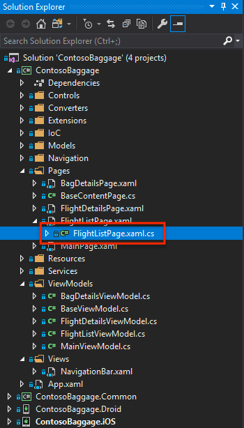

2.  Replace the implementation of the FlightListPage class with the following code:
    ```
    public partial class FlightListPage : BaseContentPage<FlightListViewModel>, INavigableXamarinFormsPage
    {
        public FlightListPage()
        {
            InitializeComponent();
        }

        protected override void OnAppearing()
        {
            base.OnAppearing();

            if (ViewModel.Flights.Count > 0 || ViewModel.IsBusy)
                return;

            ViewModel.GetFlightsCommand.Execute(null);
        }
    }

    ```

### Task 5: Add Flight List page to the navigation service

1.  Browse to the Navigation folder of ContosoBaggage. Open **NavigationService.cs**.

    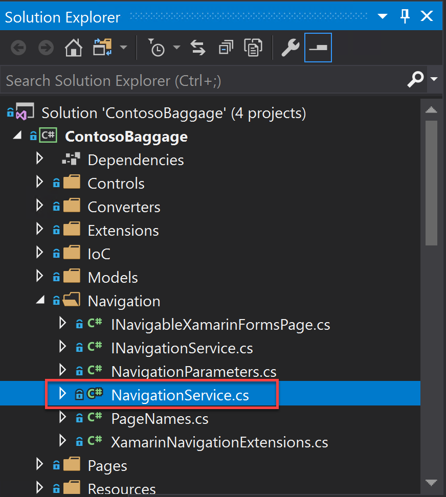

2.  Find the **GetPage** method and uncomment the **return new FlightListPage();** line. Final result should be:
    ```
    private Page GetPage(PageNames page)
    {
        switch(page)
        {
            case PageNames.MainPage:
    return new MainPage();
            case PageNames.FlightListPage:
                        return new FlightListPage();
    case PageNames.FlightDetailsPage:
                        return new FlightDetailsPage();
    case PageNames.BagDetailsPage:
                        return new BagDetailsPage();
            default:
                return null;
        }
    }

    ```

### Task 6: Run the app and verify that it successfully retrieves flight data

1.  Right-click on either the iOS or Android app (whichever you plan to debug), then choose **Set as StartUp Project**.

2.  Choose your simulator/device to launch the app on.

3.  Launch the app by choosing **Debug \> Start Debugging**.

4.  If you receive the following error, perform the steps below: "The project ContosoBaggage.Droid needs to be deployed before it can be started. Verify the project is selected to be deployed in the Solution Configuration Manager":

    -   Right-click the solution, then select **Configuration Manager...**

    -   Check **Deploy** next to the project.

        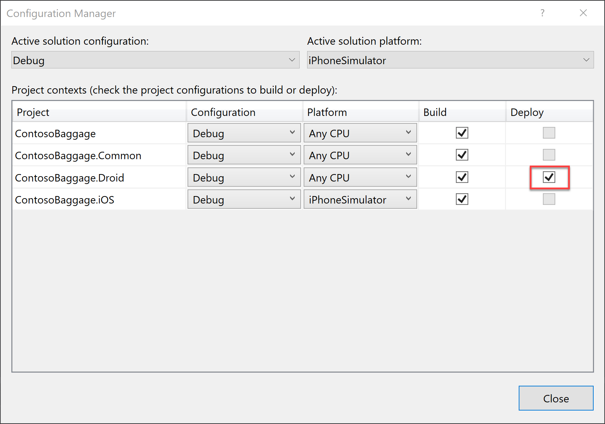

        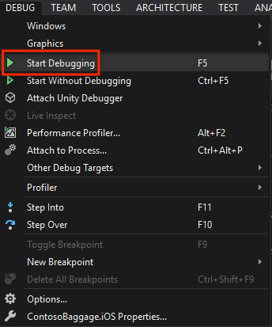

        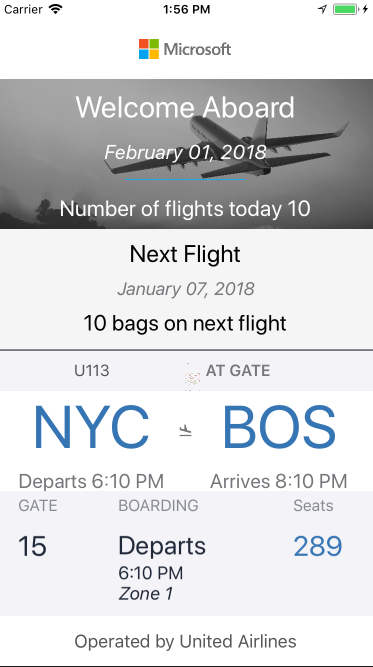

## After the hands-on lab 

**Duration**: 10 minutes

In this exercise, attendees will de-provision any Azure resources that were created in support of the lab.

### Task 1: Delete the Resource group in which you placed your Azure resources.

1.  From the Portal, navigate to the blade of your **Resource Group** and select **Delete** in the command bar at the top.

2.  Confirm the deletion by re-typing the **resource group name** and selecting **Delete**.

You should follow all steps provided *after* attending the Hands-on lab.